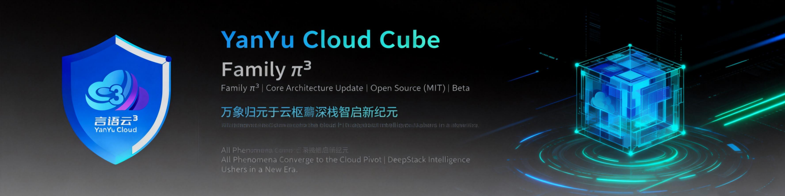

<p align="center">
  
</p>

<p align="center">
  <strong>言启千行代码 · 语枢万物智能</strong>
</p>

<p align="center">
  下一代 AI 知识库与智能技能管理平台 — 五维驱动 · 全链路闭环
</p>

<p align="center">
  <a href="#-项目概览"></a>
  <a href="#-架构全景"></a>
  <a href="#-核心生态"></a>
  <a href="#-五维驱动"></a>
  <a href="#-快速开始"></a>
</p>

<p align="center">
  
  
  
  
  
  
  
  
  
  
  
  
  
  
</p>

---

## 📖 项目概览

**YYC3 Knowledge Base** 是一个面向 NVIDIA AI 全栈生态的下一代智能知识库与技能管理平台。以"五维驱动"为核心理念，覆盖从 **RAG 检索增强生成**、**NemoClaw 沙箱安全**、**Dynamo 推理服务编排**、**Megatron-Bridge 分布式训练** 到 **NeMo 全链路模型自动化** 的完整 AI 基础设施知识体系。

### 核心特性

| 特性 | 说明 |
|------|------|
| 🎯 **全栈覆盖** | NVIDIA AI 生态 9 大分类、40+ 实践指南、200+ 操作步骤 |
| 🎨 **卡片化看板** | 可视化仪表盘，进度追踪、分类筛选、难度标记一目了然 |
| 🔗 **步骤级深度链接** | 支持直达任意步骤的 URL 哈希路由，分享与导航精准高效 |
| 💾 **离线持久化** | 基于 localStorage 的进度管理，断网可用，隐私安全 |
| 🌓 **暗亮双主题** | 自适应主题系统，持久化用户偏好 |
| 📋 **进度可视化** | 全局进度条 + 卡片级步骤计数器，学习路径清晰可控 |
| 📤 **导出/导入** | 进度数据可导出备份或跨设备迁移 |
| 🗂️ **工作区总览** | [YYC3-KNOWLEDGE-BASE.html](docs/YYC3-KNOWLEDGE-BASE.html) 展示 16 大领域、54 个开源项目的全量工作区卡片看板 |

---

## 🏗️ 架构全景

```
┌─────────────────────────────────────────────────────────────────────────────┐
│                          YYC3 KNOWLEDGE BASE                                │
├─────────────────────────────────────────────────────────────────────────────┤
│                                                                             │
│  ┌──────────────────────────────────────────────────────────────┐           │
│  │                     FRONTEND LAYER                            │           │
│  │  ┌──────────┐  ┌──────────────┐  ┌────────────────────────┐  │           │
│  │  │ THEME    │  │ SIDEBAR      │  │ DASHBOARD              │  │           │
│  │  │  ├─暗/亮  │  │  ├─分组导航   │  │  ├─统计汇总            │  │           │
│  │  │  └─持久化 │  │  ├─搜索过滤   │  │  ├─过滤栏(分类/难度)   │  │           │
│  │  │          │  │  ├─进度条     │  │  └─卡片网格            │  │           │
│  │  │ ROUTER   │  │  └─导出/导入  │  │    ├─进度徽章          │  │           │
│  │  │  ├─hash  │  │              │  │    ├─步骤预览条         │  │           │
│  │  │  └─解析   │  │ DETAIL      │  │    └─模态框触发器       │  │           │
│  │  │          │  │  ├─概述表格   │  │                      │  │           │
│  │  │ STORAGE  │  │  ├─步骤列表   │  │ MODAL               │  │           │
│  │  │  ├─guide │  │  ├─代码块    │  │  ├─全部步骤列表       │  │           │
│  │  │  ├─step  │  │  └─完成勾选  │  │  └─逐项跳转          │  │           │
│  │  │  └─theme │  │              │  │                      │  │           │
│  │  └──────────┘  └──────────────┘  └────────────────────────┘  │           │
│  └──────────────────────────────────────────────────────────────┘           │
│                                    │                                        │
│  ┌──────────────────────────────────────────────────────────────┐           │
│  │                     DATA LAYER                                │           │
│  │  ┌────────────────────────────────────────────────────────┐  │           │
│  │  │              GUIDES (40 guides, 200+ steps)            │  │           │
│  │  │  RAG │ NemoClaw │ Dynamo │ Megatron │ NeMo │ Earth2   │  │           │
│  │  └────────────────────────────────────────────────────────┘  │           │
│  │  ┌────────────────────────────────────────────────────────┐  │           │
│  │  │              STORAGE (localStorage)                     │  │           │
│  │  │  guide-done-{id} │ step-done-{id}-{n} │ theme          │  │           │
│  │  └────────────────────────────────────────────────────────┘  │           │
│  └──────────────────────────────────────────────────────────────┘           │
│                                    │                                        │
│  ┌──────────────────────────────────────────────────────────────┐           │
│  │                   KNOWLEDGE BASE LAYER                        │           │
│  │  ┌────────┐ ┌──────────┐ ┌────────┐ ┌────────┐ ┌────────┐  │           │
│  │  │YYC3-A  │ │ YYC3-B   │ │ YYC3-C │ │ YYC3-D │ │ YYC3-E │  │           │
│  │  │Types   │ │ Standards│ │ Tools  │ │ UI/ICU│ │ i18n   │  │           │
│  │  ├────────┤ ├──────────┤ ├────────┤ ├────────┤ ├────────┤  │           │
│  │  │YYC3-F  │ │ YYC3-H   │ │ YYC3-J │ │ YYC3-N │ │ docs   │  │           │
│  │  │Skills  │ │ Agent/K8s│ │ Skills │ │ Python │ │ 指南    │  │           │
│  │  └────────┘ └──────────┘ └────────┘ └────────┘ └────────┘  │           │
│  └──────────────────────────────────────────────────────────────┘           │
│                                                                             │
└─────────────────────────────────────────────────────────────────────────────┘
```

### 技术栈

| 层级 | 技术 | 说明 |
|------|------|------|
| 🎨 **UI** | HTML5 + CSS3 (CSS Variables) | 纯原生渲染，零依赖 |
| ⚡ **逻辑** | Vanilla JavaScript (ES6+) | ~25KB 核心引擎 + ~80KB 数据 |
| 🔗 **路由** | Hash-based Router | `#guide-{id}[-step-{n}]` 深度链接 |
| 💾 **存储** | Web localStorage | 40篇指南约4KB，远未触及5MB上限 |
| 🔤 **字体** | Google Fonts (Inter) | 按需加载，~15KB |
| 📦 **总大小** | ~120KB | 首次加载3个HTTP请求 |

---

## 🧩 核心生态

### 知识体系模块

```
YYC3 Knowledge Base
│
├── 🅰️ YYC3-A — 类型定义生态
│   └── DefinitelyTyped 类型定义库（TypeScript 类型声明）
│
├── 🅱️ YYC3-B — Web 标准与智能体生态
│   ├── Web 标准：HTML / DOM / Fetch / URL / XHR / Streams / Encoding 等
│   ├── 智能体：Agent 文档、Skill 框架、浏览器自动化
│   ├── VS Code 扩展生态：主题、语言、工具链
│   └── 社区插件市场：CodeBuddy、BuildWithClaude 等
│
├── ©️ YYC3-C — 开发者工具生态
│   ├── Docker (Moby) 容器引擎
│   ├── Lucide 图标库 / Emmet 代码补全
│   └── VS Code 编辑器核心
│
├── 🇩 YYC3-D — UI 框架与国际化
│   ├── ICU 国际化组件
│   └── 前端 UI 框架与组件库
│
├── 🇪 YYC3-E — 边缘部署与本地化
│   ├── Goose 边缘执行引擎
│   ├── Edict 轻量部署工具
│   └── i18n 国际化数据
│
├── 🇫 YYC3-F — AI 平台与技能生态
│   ├── Khoj AI 搜索引擎
│   ├── Ruff Python 静态分析
│   ├── Shannon / Pi 智能体平台
│   ├── Gstack GPU 栈管理
│   └── Zeroclaw 部署工具
│
├── 🇭 YYC3-H — 底层运行与编排
│   ├── Agent (Rust) 高性能智能体运行时
│   ├── Kubernetes 容器编排
│   ├── MUI-X 企业级 UI 组件
│   └── Spotube 音视频工具
│
├── 🇯 YYC3-J — 技能与集成市场
│   ├── Antigravity Awesome Skills 技能集合
│   ├── LobeHub / Serena 智能体平台
│   ├── Redux / Vuex 状态管理
│   ├── One-API / New-API 统一网关
│   └── MagicPython / Code-Skills 开发工具
│
├── 🇳 YYC3-N — Python 运行时生态
│   ├── Python 标准库实现
│   ├── Conda 包管理环境
│   └── 数据科学/AI 框架依赖
│
└── 📚 docs — 项目文档
    ├── YYC3-KNOWLEDGE-BASE.html — 工作区总览（可脱机分享的 HTML 看板）
    ├── DGX-SPARK-HUB.html — DGX Spark 操作中心（在线版）
    ├── DGX-SPARK-HUB-OFFLINE.html — DGX Spark 操作中心（离线版）
    ├── 技术实现边界.md — 架构设计与延伸路径
    ├── 卡片信息.md — 卡片数据规范
    └── 命令信息.md — CLI 命令索引
```

### AI 实践指南体系

| # | 生态域 | 指南数 | 核心能力 |
|---|--------|:------:|----------|
| 1 | 🔒 **NemoClaw** — 沙箱安全与管理 | 16 | 安全配置、策略管理、沙箱部署、监控 |
| 2 | 🔍 **RAG** — 检索增强生成 | 12 | 蓝图部署、性能基准、质量评估、检索配方 |
| 3 | ⚡ **Dynamo** — 推理服务编排 | 11 | 路由器、配方部署、互联检查、故障排除 |
| 4 | 🚀 **Megatron-Bridge** — 分布式训练 | 30 | 多节点 Slurm、MoE 优化、FSDP、并行策略 |
| 5 | 🤖 **NeMo AutoModel** — 模型自动化 | 6 | 启动配置、分布式训练、模型接入 |
| 6 | 🎯 **NeMo-RL** — 强化学习 | 6 | 自动研究、启动部署、会话内存 |
| 7 | 🗣️ **Nemotron** — 语音与定制化 | 4 | 语音 Riva、定制化服务 |
| 8 | 🌤️ **Earth2Studio** — 天气气候 AI | 7 | 气候模型、地球系统模拟 |
| 9 | 📊 **其他生态** | — | 性能优化、部署运维、最佳实践 |

---

## 📊 五维驱动

### 五高架构

| 维度 | 实现 | 标准 |
|------|------|------|
| **高可用** | 纯前端离线运行，零服务端依赖 | 99.9% 可用性 |
| **高性能** | 单页面应用，~120KB 全量加载 | <500ms 首屏渲染 |
| **高安全** | 无服务端通信，全量本地存储 | 数据不出设备 |
| **高可扩展** | 模块化数据架构，支持渐进增强 | 40+ 指南持续增长 |
| **高智能** | 步骤级深度链接、模糊搜索增强 | 精准知识导航 |

### 五化标准

```
标准化 ─── 统一的卡片/步骤/分类数据规范
规范化 ─── 一致的命名、编码、存储模式
自动化 ─── 进度追踪、状态同步、导出导入全自动
可视化 ─── 看板仪表盘、进度条、分类色标体系
智能化 ─── 深度链接路由、自适应主题、智能过滤
```

### 五维评价

```
时间维度 ─── 开发效率 → 构建速度 → 加载优化
空间维度 ─── 代码组织 → 组件架构 → 资源效率
属性维度 ─── 性能 → 安全 → 可维护 → 可复用
事件维度 ─── 交互处理 → 状态管理 → 错误处理
关联维度 ─── 组件依赖 → API 集成 → 生态连接
```

---

## 🚀 快速开始

### 本地运行

```bash
# 克隆仓库
git clone https://github.com/YYC-Cube/YYC3-Knowledge-Base.git

# 工作区总览（推荐入口）
open docs/YYC3-KNOWLEDGE-BASE.html

# DGX Spark 操作中心
open docs/DGX-SPARK-HUB.html

# 或使用本地服务器
python3 -m http.server 8080
# 访问 http://localhost:8080/docs/YYC3-KNOWLEDGE-BASE.html
```

### 使用场景

```
�️ 浏览工作区总览 → 通过 YYC3-KNOWLEDGE-BASE.html 查看全部 54 个项目卡片
� 学习 NVIDIA AI 全栈技术 → 通过 DGX-SPARK-HUB 看板浏览 40+ 实践指南
🎯 按步骤操作 AI 基础设施 → 利用深度链接直达任意步骤
📊 追踪学习进度 → 自动保存每一步的完成状态
🔍 快速检索知识 → 通过分类/难度过滤 + 搜索定位
📤 迁移工作进度 → 导出/导入进度数据跨设备同步
```

### 自定义扩展

```javascript
// 添加新的指南
const newGuide = {
  id: "custom-001",
  category: "custom",
  title: "自定义指南",
  difficulty: "⭐",
  time: "30 min",
  tags: ["自定义"],
  steps: [
    { n: 1, title: "第一步", meta: "10 min" },
    { n: 2, title: "第二步", meta: "20 min" }
  ]
};
GUIDES.push(newGuide);
```

---

## 🔗 相关资源

| 资源 | 链接 |
|------|------|
| 📦 GitHub 仓库 | [YYC3-Knowledge-Base](https://github.com/YYC-Cube/YYC3-Knowledge-Base.git) |
| 🗂️ 工作区总览 | [docs/YYC3-KNOWLEDGE-BASE.html](docs/YYC3-KNOWLEDGE-BASE.html) |
| 🚀 DGX Spark 操作中心 | [docs/DGX-SPARK-HUB.html](docs/DGX-SPARK-HUB.html) |
| 📖 项目文档 | [docs/](docs/) |
| 🖼️ 品牌资源 | [public/](public/) |
| 📋 卡片规范 | [docs/卡片信息.md](docs/卡片信息.md) |
| 🏗️ 技术架构 | [docs/技术实现边界.md](docs/技术实现边界.md) |
| 📟 命令索引 | [docs/命令信息.md](docs/命令信息.md) |

---

<p align="center">
  <sub>Built with ❤️ by the YYC3 Team · 五维驱动 · 智能赋能</sub>
  <br />
  <sub>言启千行代码，语枢万物智能</sub>
</p>
