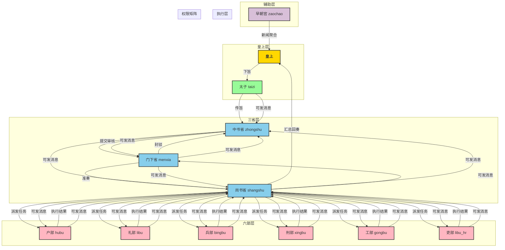
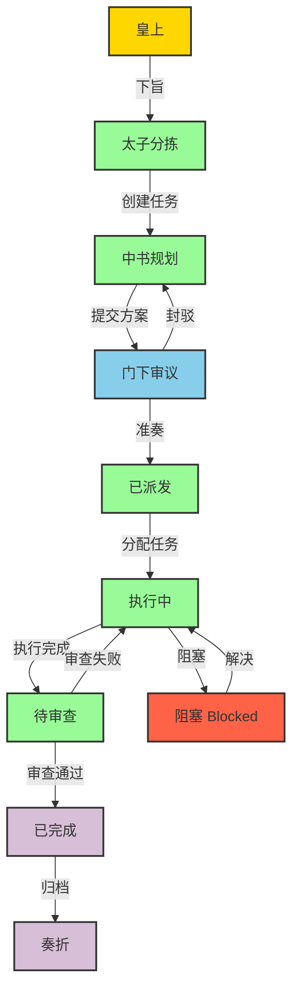
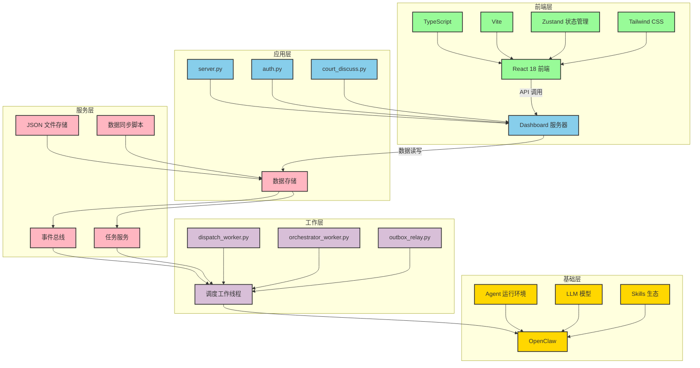
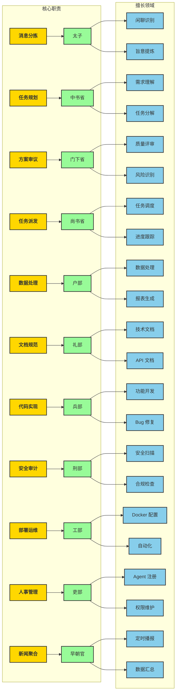
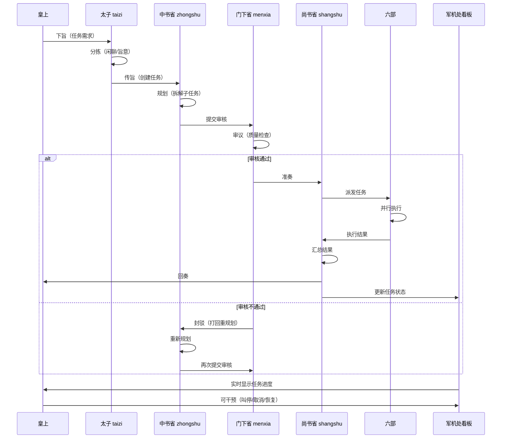

# 三省六部 · Edict 架构图

## 1. 智能 Agent 协同架构图

```mermaid
graph TD
    subgraph 皇上层
        A[皇上] --> |下旨| B[太子 taizi]
    end

    subgraph 三省层
        B --> |传旨| C[中书省 zhongshu]
        C --> |提交审核| D[门下省 menxia]
        D --> |准奏| E[尚书省 shangshu]
        D --> |封驳| C
    end

    subgraph 六部层
        E --> |派发任务| F[户部 hubu]
        E --> |派发任务| G[礼部 libu]
        E --> |派发任务| H[兵部 bingbu]
        E --> |派发任务| I[刑部 xingbu]
        E --> |派发任务| J[工部 gongbu]
        E --> |派发任务| K[吏部 libu_hr]
    end

    subgraph 辅助层
        L[早朝官 zaochao] --> |新闻聚合| A
    end

    subgraph 执行层
        F --> |执行结果| E
        G --> |执行结果| E
        H --> |执行结果| E
        I --> |执行结果| E
        J --> |执行结果| E
        K --> |执行结果| E
        E --> |汇总回奏| A
    end

    subgraph 权限矩阵
        B -- 可发消息 --> C
        C -- 可发消息 --> D
        C -- 可发消息 --> E
        D -- 可发消息 --> C
        D -- 可发消息 --> E
        E -- 可发消息 --> C
        E -- 可发消息 --> D
        E -- 可发消息 --> F
        E -- 可发消息 --> G
        E -- 可发消息 --> H
        E -- 可发消息 --> I
        E -- 可发消息 --> J
        E -- 可发消息 --> K
        F -- 可发消息 --> E
        G -- 可发消息 --> E
        H -- 可发消息 --> E
        I -- 可发消息 --> E
        J -- 可发消息 --> E
        K -- 可发消息 --> E
    end

    classDef 皇上 fill:#FFD700,stroke:#333,stroke-width:2px,color:#333,font-weight:bold;
    classDef 太子 fill:#98FB98,stroke:#333,stroke-width:2px,color:#333;
    classDef 三省 fill:#87CEEB,stroke:#333,stroke-width:2px,color:#333;
    classDef 六部 fill:#FFB6C1,stroke:#333,stroke-width:2px,color:#333;
    classDef 辅助 fill:#D8BFD8,stroke:#333,stroke-width:2px,color:#333;

    class A 皇上;
    class B 太子;
    class C,D,E 三省;
    class F,G,H,I,J,K 六部;
    class L 辅助;
```

## 2. 任务状态流转架构图

```mermaid
graph TD
    A[皇上] --> |下旨| B[太子分拣]
    B --> |创建任务| C[中书规划]
    C --> |提交方案| D[门下审议]
    D --> |准奏| E[已派发]
    D --> |封驳| C
    E --> |分配任务| F[执行中]
    F --> |执行完成| G[待审查]
    G --> |审查通过| H[已完成]
    G --> |审查失败| F
    H --> |归档| I[奏折]
    F --> |阻塞| J[阻塞 Blocked]
    J --> |解决| F

    classDef 初始 fill:#FFD700,stroke:#333,stroke-width:2px,color:#333;
    classDef 流转 fill:#98FB98,stroke:#333,stroke-width:2px,color:#333;
    classDef 审核 fill:#87CEEB,stroke:#333,stroke-width:2px,color:#333;
    classDef 执行 fill:#FFB6C1,stroke:#333,stroke-width:2px,color:#333;
    classDef 完成 fill:#D8BFD8,stroke:#333,stroke-width:2px,color:#333;
    classDef 阻塞 fill:#FF6347,stroke:#333,stroke-width:2px,color:#333;

    class A 初始;
    class B,C,E,F,G 流转;
    class D 审核;
    class H,I 完成;
    class J 阻塞;
```

## 3. 技术架构层级图

```mermaid
graph TD
    subgraph 前端层
        A[React 18 前端] --> |API 调用| B[Dashboard 服务器]
        A1[TypeScript] --> A
        A2[Vite] --> A
        A3[Zustand 状态管理] --> A
        A4[Tailwind CSS] --> A
    end

    subgraph 应用层
        B --> |数据读写| C[数据存储]
        B1[server.py] --> B
        B2[auth.py] --> B
        B3[court_discuss.py] --> B
    end

    subgraph 服务层
        C --> D[事件总线]
        C --> E[任务服务]
        C1[JSON 文件存储] --> C
        C2[数据同步脚本] --> C
    end

    subgraph 工作层
        D --> F[调度工作线程]
        E --> F
        F1[dispatch_worker.py] --> F
        F2[orchestrator_worker.py] --> F
        F3[outbox_relay.py] --> F
    end

    subgraph 基础层
        F --> G[OpenClaw]
        G1[Agent 运行环境] --> G
        G2[LLM 模型] --> G
        G3[Skills 生态] --> G
    end

    classDef 前端 fill:#98FB98,stroke:#333,stroke-width:2px,color:#333;
    classDef 应用 fill:#87CEEB,stroke:#333,stroke-width:2px,color:#333;
    classDef 服务 fill:#FFB6C1,stroke:#333,stroke-width:2px,color:#333;
    classDef 工作 fill:#D8BFD8,stroke:#333,stroke-width:2px,color:#333;
    classDef 基础 fill:#FFD700,stroke:#333,stroke-width:2px,color:#333;

    class A,A1,A2,A3,A4 前端;
    class B,B1,B2,B3 应用;
    class C,C1,C2,D,E 服务;
    class F,F1,F2,F3 工作;
    class G,G1,G2,G3 基础;
```

## 4. Agent 职责矩阵图

```mermaid
graph LR
    subgraph 核心职责
        A[消息分拣] --> taizi[太子]
        B[任务规划] --> zhongshu[中书省]
        C[方案审议] --> menxia[门下省]
        D[任务派发] --> shangshu[尚书省]
        E[数据处理] --> hubu[户部]
        F[文档规范] --> libu[礼部]
        G[代码实现] --> bingbu[兵部]
        H[安全审计] --> xingbu[刑部]
        I[部署运维] --> gongbu[工部]
        J[人事管理] --> libu_hr[吏部]
        K[新闻聚合] --> zaochao[早朝官]
    end

    subgraph 擅长领域
        taizi --> A1[闲聊识别]
        taizi --> A2[旨意提炼]
        zhongshu --> B1[需求理解]
        zhongshu --> B2[任务分解]
        menxia --> C1[质量评审]
        menxia --> C2[风险识别]
        shangshu --> D1[任务调度]
        shangshu --> D2[进度跟踪]
        hubu --> E1[数据处理]
        hubu --> E2[报表生成]
        libu --> F1[技术文档]
        libu --> F2[API 文档]
        bingbu --> G1[功能开发]
        bingbu --> G2[Bug 修复]
        xingbu --> H1[安全扫描]
        xingbu --> H2[合规检查]
        gongbu --> I1[Docker 配置]
        gongbu --> I2[自动化]
        libu_hr --> J1[Agent 注册]
        libu_hr --> J2[权限维护]
        zaochao --> K1[定时播报]
        zaochao --> K2[数据汇总]
    end

    classDef 核心 fill:#FFD700,stroke:#333,stroke-width:2px,color:#333,font-weight:bold;
    classDef agent fill:#98FB98,stroke:#333,stroke-width:2px,color:#333;
    classDef 领域 fill:#87CEEB,stroke:#333,stroke-width:2px,color:#333;

    class A,B,C,D,E,F,G,H,I,J,K 核心;
    class taizi,zhongshu,menxia,shangshu,hubu,libu,bingbu,xingbu,gongbu,libu_hr,zaochao agent;
    class A1,A2,B1,B2,C1,C2,D1,D2,E1,E2,F1,F2,G1,G2,H1,H2,I1,I2,J1,J2,K1,K2 领域;
```

## 5. 系统流程图

```mermaid
sequenceDiagram
    participant 皇上 as 皇上
    participant 太子 as 太子 taizi
    participant 中书省 as 中书省 zhongshu
    participant 门下省 as 门下省 menxia
    participant 尚书省 as 尚书省 shangshu
    participant 六部 as 六部
    participant 看板 as 军机处看板

    皇上->>太子: 下旨（任务需求）
    太子->>太子: 分拣（闲聊/旨意）
    太子->>中书省: 传旨（创建任务）
    中书省->>中书省: 规划（拆解子任务）
    中书省->>门下省: 提交审核
    门下省->>门下省: 审议（质量检查）
    
    alt 审核通过
        门下省->>尚书省: 准奏
        尚书省->>六部: 派发任务
        六部->>六部: 并行执行
        六部->>尚书省: 执行结果
        尚书省->>尚书省: 汇总结果
        尚书省->>皇上: 回奏
        尚书省->>看板: 更新任务状态
    else 审核不通过
        门下省->>中书省: 封驳（打回重规划）
       中书省->>中书省: 重新规划
       中书省->>门下省: 再次提交审核
    end
    
    看板->>皇上: 实时显示任务进度
    皇上->>看板: 可干预（叫停/取消/恢复）
```
