<div align="center">

# CC Switch

### Claude Code、Claude Desktop、Codex、Gemini CLI、OpenCode、OpenClaw 和 Hermes Agent 的全方位管理工具

[](https://github.com/farion1231/cc-switch/releases)
[](https://github.com/farion1231/cc-switch/releases)
[](https://tauri.app/)
[](https://github.com/farion1231/cc-switch/releases/latest)

<a href="https://trendshift.io/repositories/15372" target="_blank"></a>

### 🌐 唯一官方网站：**[ccswitch.io](https://ccswitch.io)**

<!-- 语言切换按钮 -->
<a href="#english" style="display:inline-block;padding:4px 12px;margin:0 4px;border-radius:4px;background:#3b82f6;color:white;text-decoration:none;font-size:14px;">English</a>
<a href="#chinese" style="display:inline-block;padding:4px 12px;margin:0 4px;border-radius:4px;background:#22c55e;color:white;text-decoration:none;font-size:14px;">中文</a>
| [日本語](README_JA.md) | [Deutsch](README_DE.md) | [更新日志](CHANGELOG.md)

</div>

---

## ❤️ 赞助商

> [想出现在这里？](mailto:farion1231@gmail.com)

<details open>
<summary>点击折叠</summary>

[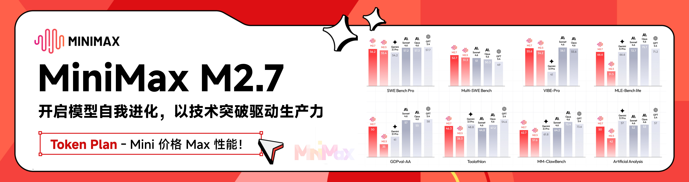](https://platform.minimaxi.com/subscribe/coding-plan?code=7kYF2VoaCn&source=link)

MiniMax M2.7 是 MiniMax 首个深度参与自我迭代的模型，可自主构建复杂 Agent Harness，并基于 Agent Teams、复杂 Skills、Tool Search Tool 等能力完成高复杂度生产力任务；其在软件工程、端到端项目交付及办公场景中表现优异，多项评测接近行业领先水平，同时具备稳定的复杂任务执行、环境交互能力以及良好的情商与身份保持能力。

[点击此处](https://platform.minimaxi.com/subscribe/coding-plan?code=7kYF2VoaCn&source=link)享 MiniMax Token Plan 专属 88 折优惠！

---

<table>
<tr>
<td width="180"><a href="https://www.packyapi.com/register?aff=cc-switch"></a></td>
<td>感谢 PackyCode 赞助了本项目！PackyCode 是一家稳定、高效的API中转服务商，提供 Claude Code、Codex、Gemini 等多种中转服务。PackyCode 为本软件的用户提供了特别优惠，使用<a href="https://www.packyapi.com/register?aff=cc-switch">此链接</a>注册并在充值时填写"cc-switch"优惠码，首次充值可以享受9折优惠！</td>
</tr>

<tr>
<td width="180"><a href="https://aigocode.com/invite/CC-SWITCH"></a></td>
<td>感谢 AIGoCode 赞助了本项目！AIGoCode 是一个集成了 Claude Code、Codex 以及 Gemini 最新模型的一站式平台，为你提供稳定、高效且高性价比的AI编程服务。本站提供灵活的订阅计划，零封号风险，国内直连，无需魔法，极速响应。AIGoCode 为 CC Switch 的用户提供了特别福利，通过<a href="https://aigocode.com/invite/CC-SWITCH">此链接</a>注册的用户首次充值可以获得额外10%奖励额度！</td>
</tr>

<tr>
<td width="180"><a href="https://www.aicodemirror.com/register?invitecode=9915W3">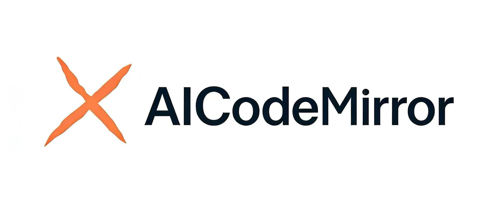</a></td>
<td>感谢 AICodeMirror 赞助了本项目！AICodeMirror 提供 Claude Code / Codex / Gemini CLI 官方高稳定中转服务，支持企业级高并发、极速开票、7×24 专属技术支持。Claude Code / Codex / Gemini 官方渠道低至 3.8 / 0.2 / 0.9 折，充值更有折上折！AICodeMirror 为 CCSwitch 的用户提供了特别福利，通过<a href="https://www.aicodemirror.com/register?invitecode=9915W3">此链接</a>注册的用户，可享受首充8折，企业客户最高可享 7.5 折！</td>
</tr>

<tr>
<td width="180"><a href="https://www.shengsuanyun.com/?from=CH_4HHXMRYF">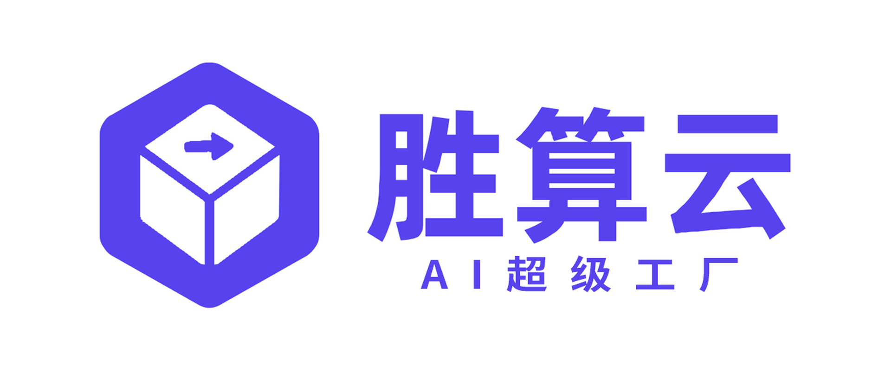</a></td>
<td>感谢胜算云赞助了本项目！胜算云是专为AI Native Teams服务的超级工厂，工业级AI任务并行执行平台，模型商城集采直供聚合接入了Claude、Chatgpt、Gemini等海内外LLM及图片视频多媒体模型算力，绝无逆向掺水、全站模型SLA可用性高达99.7%、<a href="https://watch.shengsuanyun.com/status/shengsuanyun">监测接口</a>日常全绿。更有企业级专属定制网关，实现团队精细化成本与权限管控，智能路由+安全防护+BYOK企业自带密钥托管。平台按量及tokens plan（即将上线）计费，可开票，使用<a href="https://www.shengsuanyun.com/?from=CH_4HHXMRYF">此链接</a>注册新用户可获10元模力及首充10%赠送。</td>
</tr>

<tr>
<td width="180"><a href="https://pateway.ai/?ch=etzpm8&aff=WB6M6F67#/">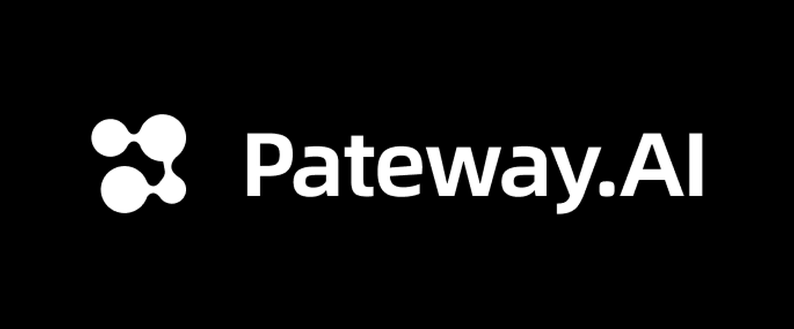</a></td>
<td>感谢 PatewayAI 赞助了本项目！PatewayAI 是一家面向重度 AI 开发者、专注官方直连高品质模型 API 中转服务商。提供 Claude 全系列与 Codex 系列模型，100% 官方源直供，不掺假不注水，欢迎检验。计费透明，Token 级账单可逐笔核验。同时支持企业级高并发，并为企业客户提供了专业的管理平台，企业客户可签订正式合同并开具发票，更多详情进入官网获取联系方式。现在通过<a href="https://pateway.ai/?ch=etzpm8&aff=WB6M6F67#/">此链接</a>注册即送 $3 试用额度，用户充值低至 6 折，邀请好友双向赠送，邀请奖励可达 $150！</td>
</tr>

<tr>
<td width="180"><a href="https://www.volcengine.com/activity/agentplan?utm_campaign=hw&utm_content=ccswitch&utm_medium=devrel_tool_web&utm_source=OWO&utm_term=ccswitch"></a></td>
<td>感谢火山方舟Agent Plan 模型赞助了本项目！方舟Agent Plan 模型订阅套餐集成了包含Doubao-Seed、Doubao-Seedance、Doubao-Seedream等在内的字节跳动自研SOTA级模型，覆盖文本、代码、图像、视频等多模态任务。同时支持一站式接入DeepSeek V4、GLM 5.1等主流大模型。超全模态模型与 Harness 升级一步到位，深度支持 Agent 框架与 AI 编程工具。方舟 Agent Plan 为 CC Switch 的用户提供了专属福利：通过<a href="https://www.volcengine.com/activity/agentplan?utm_campaign=hw&utm_content=ccswitch&utm_medium=devrel_tool_web&utm_source=OWO&utm_term=ccswitch">此链接</a>订阅方舟AgentPlan，新客户首月40元起！<a href="https://www.byteplus.com/en/product/modelark?utm_campaign=hw&utm_content=ccswitch&utm_medium=devrel_tool_web&utm_source=OWO&utm_term=ccswitch">>>For developers outside Mainland China, please click here</a></td>
</tr>

<tr>
<td width="180"><a href="https://cloud.siliconflow.cn/i/drGuwc9k">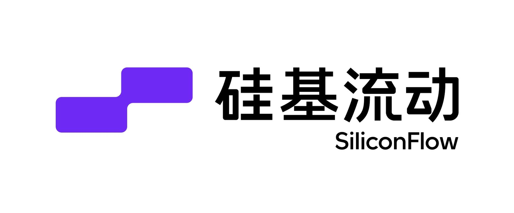</a></td>
<td>感谢硅基流动赞助了本项目！硅基流动是一个高性能 AI 基础设施与模型 API 平台，一站式提供语言、语音、图像、视频等多模态模型的快速、可靠访问。平台支持按量计费、丰富的多模态模型选择、高速推理和企业级稳定性，帮助开发者和团队更高效地构建和扩展 AI 应用。通过<a href="https://cloud.siliconflow.cn/i/drGuwc9k">此链接</a>注册并完成实名认证，即可获得 ¥16 奖励金，可在平台内跨模型使用。硅基流动现已兼容 OpenClaw，用户可接入硅基流动 API Key 免费调用主流 AI 模型。</td>
</tr>

<tr>
<td width="180"><a href="https://cubence.com/signup?code=CCSWITCH&source=ccs">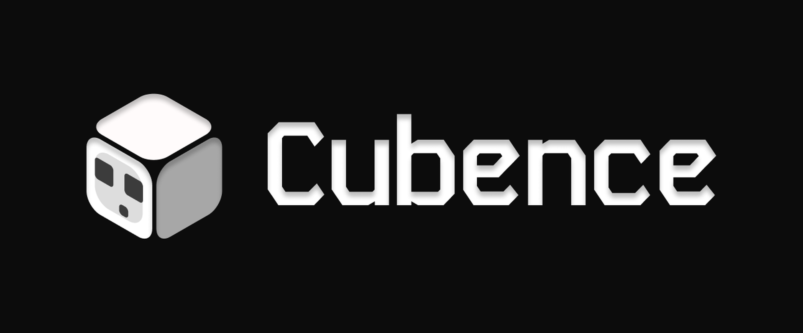</a></td>
<td>感谢 Cubence 赞助本项目！Cubence 是一家可靠高效的 API 中继服务提供商，提供对 Claude Code、Codex、Gemini 等模型的中继服务，并提供按量、包月等灵活的计费方式。Cubence 为 CC Switch 的用户提供了特别优惠：使用 <a href="https://cubence.com/signup?code=CCSWITCH&source=ccs">此链接</a> 注册，并在充值时输入 "CCSWITCH" 优惠码，每次充值均可享受九折优惠！</td>
</tr>

<tr>
<td width="180"><a href="https://www.dmxapi.cn/register?aff=bUHu">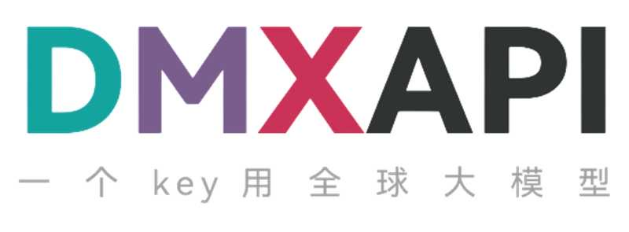</a></td>
<td>感谢 DMXAPI（大模型API）赞助了本项目！ DMXAPI，一个Key用全球大模型。为200多家企业用户提供全球大模型API服务。· 充值即开票 ·当天开票 ·并发不限制 ·1元起充 · 7x24 在线技术辅导，GPT/Claude/Gemini全部6.8折，国内模型5~8折，Claude Code 专属模型3.4折进行中！<a href="https://www.dmxapi.cn/register?aff=bUHu">点击这里注册</a></td>
</tr>

<tr>
<td width="180"><a href="https://www.compshare.cn/coding-plan?ytag=GPU_YY_YX_git_cc-switch">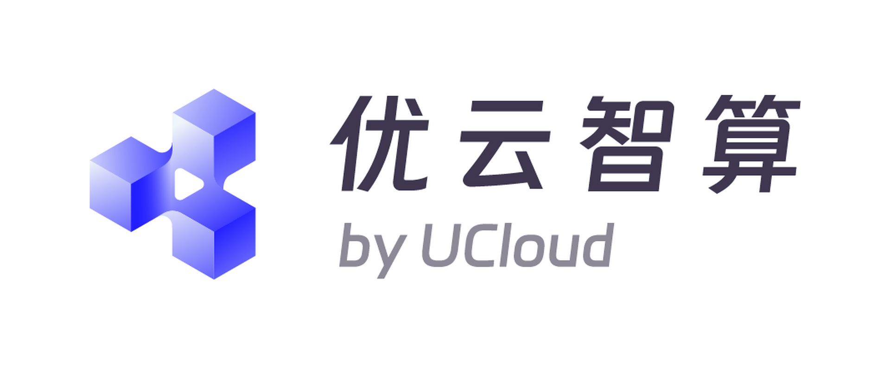</a></td>
<td>感谢优云智算赞助了本项目！优云智算是UCloud旗下AI云平台，提供稳定、全面的国内外模型API，仅一个key即可调用。主打包月、按次的高性价比国模Coding Plan套餐，同时提供官转稳定海外模型。支持接入 Claude Code、Codex 及 API 调用。支持企业高并发、7*24技术支持、自助开票。通过<a href="https://www.compshare.cn/coding-plan?ytag=GPU_YY_YX_git_cc-switch">此链接</a>注册的用户，可得免费5元平台体验金！</td>
</tr>

<tr>
<td width="180"><a href="https://crazyrouter.com/register?aff=OZcm&ref=cc-switch">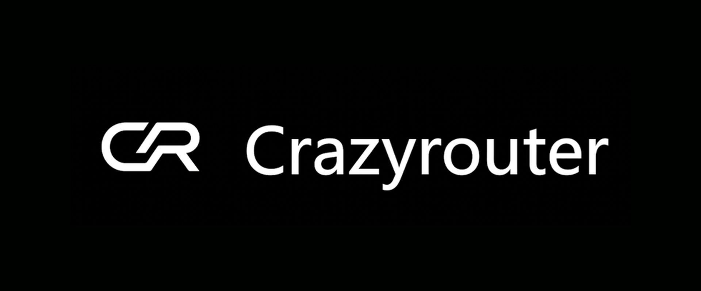</a></td>
<td>感谢 Crazyrouter 赞助了本项目！Crazyrouter 是一个高性能 AI API 聚合平台——一个 API Key 即可访问 300+ 模型，包括 Claude Code、Codex、Gemini CLI 等。全部模型低至官方定价的 55%，支持自动故障转移、智能路由和无限并发。Crazyrouter 为 CC Switch 用户提供了专属优惠：通过<a href="https://crazyrouter.com/register?aff=OZcm&ref=cc-switch">此链接</a>注册后联系客服即可领取 <strong>$2 免费额度</strong>，首次充值时输入优惠码 `CCSWITCH` 还可获得额外 <strong>30% 奖励额度</strong>！</td>
</tr>

<tr>
<td width="180"><a href="https://www.right.codes/register?aff=CCSWITCH"></a></td>
<td>感谢 Right Code 赞助了本项目！Right Code 稳定提供 Claude Code、Codex、Gemini 等模型的中转服务，并可选按量、包月两种计费模式。充值即可开票，企业、团队用户一对一对接。同时为 CC Switch 的用户提供了特别优惠：通过<a href="https://www.right.codes/register?aff=CCSWITCH">此链接</a>注册，每次充值均可获得实付金额5%的按量额度！</td>
</tr>

<tr>
<td width="180"><a href="https://www.sssaicode.com/register?ref=DCP0SM">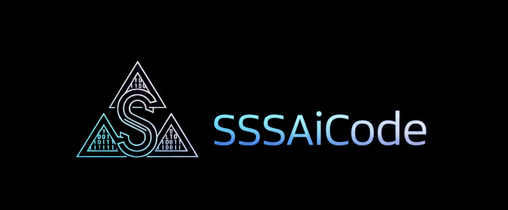</a></td>
<td>感谢 SSSAiCode 赞助了本项目！SSSAiCode 是一家稳定可靠的API中转站，致力于提供稳定、可靠、平价的Claude、CodeX模型服务，支持当日快速开票，SSSAiCode为本软件的用户提供特别优惠，使用<a href="https://www.sssaicode.com/register?ref=DCP0SM">此链接</a>注册每次充值均可享受10$的额外奖励！</td>
</tr>

<tr>
<td width="180"><a href="https://www.micuapi.ai/register?aff=aOYQ"></a></td>
<td>感谢 米醋API 赞助了本项目！米醋API 是一家致力于提供极致性价比与高稳定性的全球大模型中转服务商。米醋API 背后有实体企业做核心保障，杜绝跑路风险，支持极速正规开票！我们主打"试错零成本"：1 元起充低门槛，0 手续费随时退款！米醋API 为本软件的用户提供了特别优惠，使用<a href="https://www.micuapi.ai/register?aff=aOYQ">此链接</a>注册并在充值时填写"ccswitch"优惠码可享九折优惠！</td>
</tr>

<tr>
<td width="180"><a href="https://lemondata.cc/r/FFX1ZDUP"></a></td>
<td>感谢 LemonData 赞助了本项目！LemonData 是一个高性能 AI API 聚合平台——一个 API Key 即可访问 GPT、Claude、Gemini、DeepSeek 等 300+ 模型。所有模型定价为官方价格的 30%-70%，支持自动故障转移、智能路由和无限并发。新用户注册即获 $1 免费额度——通过<a href="https://lemondata.cc/r/FFX1ZDUP">此链接</a>注册即可领取奖励，立即开始开发！</td>
</tr>

<tr>
<td width="180"><a href="https://ctok.ai">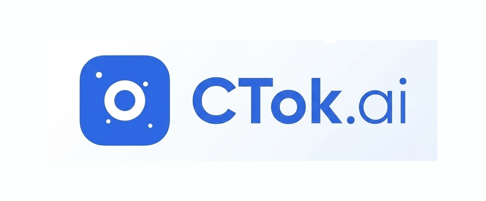</a></td>
<td>感谢 CTok.ai 赞助了本项目！CTok.ai 致力于打造一站式 AI 编程工具服务平台。我们提供 Claude Code 专业套餐及技术社群服务，同时支持 Google Gemini 和 OpenAI Codex。通过精心设计的套餐方案和专业的技术社群，为开发者提供稳定的服务保障和持续的技术支持，让 AI 辅助编程真正成为开发者的生产力工具。点击<a href="https://ctok.ai">这里</a>注册！</td>
</tr>

<tr>
<td width="180"><a href="https://console.claudeapi.com/register?aff=pCLD">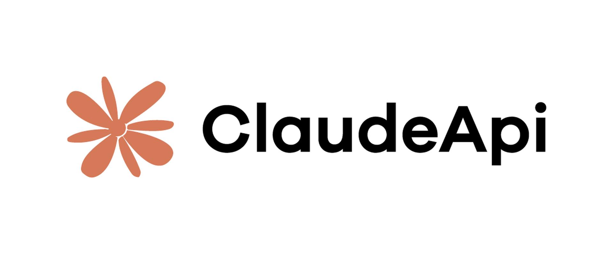</a></td>
<td>本项目由 <a href="https://console.claudeapi.com/register?aff=pCLD">Claude API</a> 赞助。Claude API 直连，三分钟接入 Claude Code 与 Agent 应用，新用户可领取测试额度。基于 Anthropic 官方 Key + AWS Bedrock 官方渠道，非逆向、非降智，支持 Opus / Sonnet / Haiku 全系列模型，保留 Tool Use、1M 上下文等官方能力。适合 Claude Code 深度用户、Agent 工程师与企业技术团队，支持开票和团队对接。点击<a href="https://console.claudeapi.com/register?aff=pCLD">这里</a>注册！</td>
</tr>

<tr>
<td width="180"><a href="https://claudecn.top">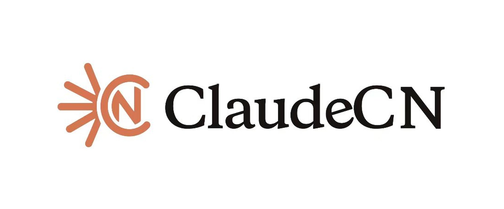</a></td>
<td>感谢 ClaudeCN 赞助本项目！ClaudeCN 是一家实体企业运营的企业级AI中转平台。平台可提供高可用性的商用API服务，提供Claude、GPT、Deepseek等热门模型，支持企业采购流程，可对公打款、签约，服务合规有保障。点击<a href="https://claudecn.top">此链接</a>注册！</td>
</tr>

<tr>
<td width="180"><a href="https://runapi.co">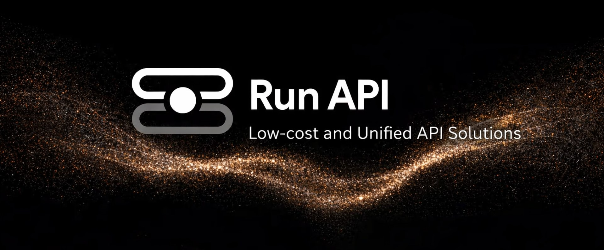</a></td>
<td>感谢 RunAPI 赞助本项目！RunAPI 是高效稳定的 AI 模型 API 中转平台，一个 API Key 即可访问 OpenAI、Claude、Gemini、DeepSeek、Grok 等 150+ 主流模型，低至 1 折，极其稳定，可以无缝兼容 Claude Code、OpenClaw 等工具。RunAPI为CC switch的用户提供了特别福利，注册后联系客服可以领取14元额度，点击<a href="https://runapi.co">此链接</a>注册！</td>
</tr>

<tr>
<td width="180"><a href="https://apikey.fun/register?aff=CCSwitch">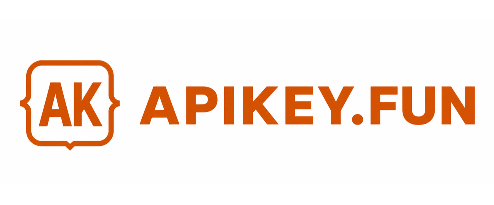</a></td>
<td>感谢 APIKEY.FUN 赞助本项目！APIKEY.FUN 是一家专业的企业级 AI 中转站，致力于为企业和个人开发者提供稳定、高效、低成本的 AI 模型 API 接入服务。平台支持 Claude、OpenAI、Gemini 等主流热门模型，价格低至官方原价的 7%。通过本项目<a href="https://apikey.fun/register?aff=CCSwitch">专属链接</a>注册，还可享受最高 <strong>充值永久 95 折</strong> 专属优惠。</td>
</tr>

<tr>
<td width="180"><a href="https://apinebula.com/02rw5X">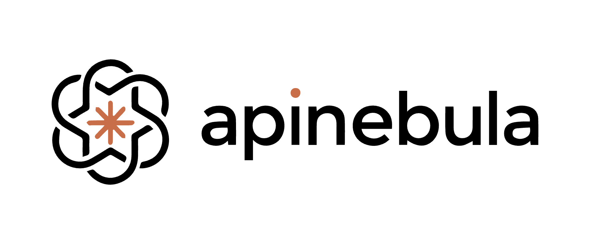</a></td>
<td>感谢 APINEBULA 赞助本项目！APINEBULA 是银河录像局旗下的企业级 AI 聚合平台，背靠大平台资源，面向开发者、团队与企业用户提供稳定、高性价比的大模型 API 接入服务。平台聚合 Claude、GPT、Gemini 等主流满血模型，一个接口，接入全球顶尖 AI 大模型，各大模型价格低至 1 折起，支持企业级高并发、正式合同、对公打款与开票服务，适合 AI 编程、Agent 开发、业务系统集成等多种场景！使用<a href="https://apinebula.com/02rw5X">此链接</a>注册并在充值时填写 <strong>"ccswitch"</strong> 优惠码可享<strong>九折优惠</strong>！</td>
</tr>

<tr>
<td width="180"><a href="https://www.atlascloud.ai/coding-plan?utm_source=github&utm_campaign=cc-switch">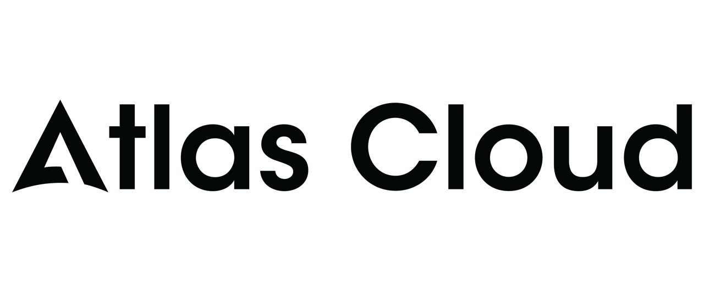</a></td>
<td>Atlas Cloud 是一个全模态 AI 推理平台，通过单一 API 为开发者提供视频生成、图像生成及 LLM 接入。免去繁琐的多供应商对接，一次连接即可调用 300+ 款全模态精选模型。立即查看 Atlas Cloud 全新<a href="https://www.atlascloud.ai/coding-plan?utm_source=github&utm_campaign=cc-switch">“编程计划”</a>优惠，获取更具性价比的 API 接入！</td>
</tr>

</table>

</details>

---

## 为什么选择 CC Switch？

现代 AI 编程依赖于 Claude Code、Claude Desktop、Codex、Gemini CLI、OpenCode、OpenClaw 和 Hermes 等工具——但每个工具都有自己的配置格式。切换 API 供应商意味着手动编辑 JSON、TOML 或 `.env` 文件，而在多个工具之间缺乏一个统一管理 MCP、SKILLS 的方式。

**CC Switch** 为你提供一个桌面应用来管理所有支持的 AI 工具。无需手动编辑配置文件，你将获得一个可视化界面，一键将供应商导入应用，一键在不同的供应商之间进行切换，内置 50+ 供应商预设、统一的 MCP、SKILLS 管理以及系统托盘即时切换功能——所有操作都基于可靠的 SQLite 数据库和原子写入机制，保护你的配置不被损坏。

- **一个应用，七个工具** — 在单一界面中管理 Claude Code、Claude Desktop、Codex、Gemini CLI、OpenCode、OpenClaw 和 Hermes
- **告别手动编辑** — 50+ 供应商预设，包括 AWS Bedrock、NVIDIA NIM 和社区中转服务；一键即可切换
- **统一 MCP、SKILLS 管理** — 一个面板管理 Claude、Codex、Gemini、OpenCode 和 Hermes 的 MCP、SKILLS，支持双向同步
- **系统托盘快速切换** — 从托盘菜单即时切换供应商，无需打开完整应用
- **云同步** — 通过 Dropbox、OneDrive、iCloud 或 WebDAV 服务器在不同设备之间同步供应商数据
- **跨平台** — 基于 Tauri 2 构建的原生桌面应用，支持 Windows、macOS 和 Linux
- **小工具** — 内置了多种小工具来解决首次安装登录确认、禁止签名、插件拓展同步等多种功能

---

## 界面预览

|                  主界面                   |                  添加供应商                  |
| :---------------------------------------: | :------------------------------------------: |
|  |  |

---

## 功能特性

[完整更新日志](CHANGELOG.md) | [发布说明](docs/release-notes/v3.16.1-zh.md)

### 供应商管理

- **7 个支持工具，50+ 预设** — Claude Code、Claude Desktop、Codex、Gemini CLI、OpenCode、OpenClaw、Hermes；复制 key 即可一键导入
- **通用供应商** — 一份配置同步到 Claude Code、Codex 和 Gemini CLI
- 一键切换、系统托盘快速访问、拖拽排序、导入导出

### 代理与故障转移

- **本地代理热切换** — 格式转换、自动故障转移、熔断器、供应商健康监控和整流器
- **应用级代理接管** — 独立为 Claude、Codex 或 Gemini 配置代理，具体到单个供应商

### MCP、Prompts 与 Skills

- **统一 MCP 面板** — 管理 Claude、Codex、Gemini、OpenCode 和 Hermes 的 MCP 服务器，双向同步，支持 Deep Link 导入
- **Prompts** — Markdown 编辑器，跨应用同步（CLAUDE.md / AGENTS.md / GEMINI.md），回填保护
- **Skills** — 从 GitHub 仓库或 ZIP 文件一键安装，自定义仓库管理，支持软连接和文件复制

### 用量与成本追踪

- **用量仪表盘** — 跨供应商追踪支出、请求数和 Token 用量，趋势图表、详细请求日志和自定义模型定价

### 会话管理器与工作区

- 浏览、搜索和恢复支持的会话来源
- **工作区编辑器**（OpenClaw）— 编辑 Agent 文件（AGENTS.md、SOUL.md 等），支持 Markdown 预览

### 系统与平台

- **云同步** — 自定义配置目录（Dropbox、OneDrive、iCloud、坚果云、NAS）及 WebDAV 服务器同步
- **Deep Link** (`ccswitch://`) — 通过 URL 一键导入供应商、MCP 服务器、提示词和技能
- 深色 / 浅色 / 跟随系统主题、开机自启、自动更新、原子写入、自动备份、国际化（简中/繁中/英/日）

---

## 常见问题

<details>
<summary><strong>CC Switch 支持哪些 AI 工具？</strong></summary>

CC Switch 支持七个工具：**Claude Code**、**Claude Desktop**、**Codex**、**Gemini CLI**、**OpenCode**、**OpenClaw** 和 **Hermes**。每个工具都有专属的供应商预设和配置管理。

</details>

<details>
<summary><strong>切换供应商后需要重启终端吗？</strong></summary>

大多数工具需要重启终端或 CLI 工具才能使更改生效。例外的是 **Claude Code**，它目前支持供应商数据的热切换，无需重启。

</details>

<details>
<summary><strong>切换供应商之后我的插件配置怎么不见了？</strong></summary>

CC Switch 使用"通用配置片段"功能，在不同的供应商之间传递 Key 和请求地址之外的通用数据。您可以在"编辑供应商"菜单的"通用配置面板"里，点击"从当前供应商提取"，把所有的通用数据提取到通用配置中。之后在新建"供应商"的时候，只要勾选"写入通用配置"（默认勾选），就会把插件等数据写入到新的供应商配置中。您的所有配置项都会保存在运行本软件时第一次导入的默认供应商里面，不会丢失。

</details>

<details>
<summary><strong>macOS 安装</strong></summary>

CC Switch macOS 版本已通过 Apple 代码签名和公证，可直接下载安装，无需额外操作。推荐使用 `.dmg` 安装包。

</details>

<details>
<summary><strong>为什么总有一个正在激活中的供应商无法删除？</strong></summary>

本软件的设计原则是"最小侵入性"，即使卸载本软件，也不会影响应用的正常使用。所以系统总会保留一个正在激活中的配置，因为如果将所有配置全部删除，该应用将无法正常使用。如果你不经常使用某个对应的应用，可以在设置中关掉该应用的显示。如果你想切换回官方登录，可以参考下条。

</details>

<details>
<summary><strong>如何切换回官方登录？</strong></summary>

可以在预设供应商里面添加一个官方供应商。切换过去之后，执行一遍 Log out / Log in 流程，之后便可以在官方供应商和第三方供应商之间随意切换。CodeX 可以在不同官方供应商之间进行切换，方便多个 Plus 或者 Team 账号之间切换。

</details>

<details>
<summary><strong>我的数据存储在哪里？</strong></summary>

- **数据库**：`~/.cc-switch/cc-switch.db`（SQLite — 供应商、MCP、提示词、技能）
- **本地设置**：`~/.cc-switch/settings.json`（设备级 UI 偏好设置）
- **备份**：`~/.cc-switch/backups/`（自动轮换，保留最近 10 个）
- **SKILLS**：`~/.cc-switch/skills/`（默认通过软链接连接到对应应用）
- **技能备份**：`~/.cc-switch/skill-backups/`（卸载前自动创建，保留最近 20 个）

</details>

---

## 文档

如需了解各项功能的详细使用方法，请查阅 **[用户手册](docs/user-manual/zh/README.md)** — 涵盖供应商管理、MCP/Prompts/Skills、代理与故障转移等全部功能。

---

## 快速开始

### 基本使用

1. **添加供应商**：点击"添加供应商" → 选择预设或创建自定义配置
2. **切换供应商**：
   - 主界面：选择供应商 → 点击"启用"
   - 系统托盘：直接点击供应商名称（立即生效）
3. **生效方式**：重启终端或对应的 CLI 工具以应用更改（Claude Code 无需重启）
4. **恢复官方登录**：添加"官方登录"预设，重启 CLI 工具后按照其登录/OAuth 流程操作

### MCP、Prompts、Skills 与会话

- **MCP**：点击"MCP"按钮 → 通过模板或自定义配置添加服务器 → 切换各应用同步开关
- **Prompts**：点击"Prompts" → 使用 Markdown 编辑器创建预设 → 激活后同步到 live 文件
- **Skills**：点击"Skills" → 浏览 GitHub 仓库 → 一键安装到支持的应用
- **会话**：点击"Sessions" → 浏览、搜索和恢复支持的会话来源

> **注意**：首次启动可以手动导入现有 CLI 工具配置作为默认供应商。

---

## 下载安装

### 系统要求

- **Windows**：Windows 10 及以上
- **macOS**：macOS 12 (Monterey) 及以上
- **Linux**：Ubuntu 22.04+ / Debian 11+ / Fedora 34+ 等主流发行版

### Windows 用户

从 [Releases](../../releases) 页面下载最新版本的 `CC-Switch-v{版本号}-Windows.msi` 安装包或 `CC-Switch-v{版本号}-Windows-Portable.zip` 绿色版。

### macOS 用户

**方式一：通过 Homebrew 安装（推荐）**

```bash
brew install --cask cc-switch
```

更新：

```bash
brew upgrade --cask cc-switch
```

**方式二：手动下载**

从 [Releases](../../releases) 页面下载 `CC-Switch-v{版本号}-macOS.dmg`（推荐）或 `.zip`。

> **注意**：CC Switch macOS 版本已通过 Apple 代码签名和公证，可直接安装打开。

### Arch Linux 用户

**通过 paru 安装（推荐）**

```bash
paru -S cc-switch-bin
```

### Linux 用户

从 [Releases](../../releases) 页面下载最新版本的 Linux 安装包：

- `CC-Switch-v{版本号}-Linux.deb`（Debian/Ubuntu）
- `CC-Switch-v{版本号}-Linux.rpm`（Fedora/RHEL/openSUSE）
- `CC-Switch-v{版本号}-Linux.AppImage`（通用）

> **Flatpak**：官方 Release 不包含 Flatpak 包。如需使用，可从 `.deb` 自行构建 — 参见 [`flatpak/README.md`](flatpak/README.md)。

---

<details>
<summary><strong>架构总览</strong></summary>

### 设计原则

```
┌─────────────────────────────────────────────────────────────┐
│                    前端 (React + TS)                         │
│  ┌─────────────┐  ┌──────────────┐  ┌──────────────────┐    │
│  │ Components  │  │    Hooks     │  │  TanStack Query  │    │
│  │   （UI）     │──│ （业务逻辑）   │──│   （缓存/同步）    │    │
│  └─────────────┘  └──────────────┘  └──────────────────┘    │
└────────────────────────┬────────────────────────────────────┘
                         │ Tauri IPC
┌────────────────────────▼────────────────────────────────────┐
│                  后端 (Tauri + Rust)                         │
│  ┌─────────────┐  ┌──────────────┐  ┌──────────────────┐    │
│  │  Commands   │  │   Services   │  │  Models/Config   │    │
│  │ （API 层）   │──│  （业务层）    │──│    （数据）       │    │
│  └─────────────┘  └──────────────┘  └──────────────────┘    │
└─────────────────────────────────────────────────────────────┘
```

**核心设计模式**

- **SSOT**（单一事实源）：所有数据存储在 `~/.cc-switch/cc-switch.db`（SQLite）
- **双层存储**：SQLite 存储可同步数据，JSON 存储设备级设置
- **双向同步**：切换时写入 live 文件，编辑当前供应商时从 live 回填
- **原子写入**：临时文件 + 重命名模式防止配置损坏
- **并发安全**：Mutex 保护的数据库连接避免竞态条件
- **分层架构**：清晰分离（Commands → Services → DAO → Database）

**核心组件**

- **ProviderService**：供应商增删改查、切换、回填、排序
- **McpService**：MCP 服务器管理、导入导出、live 文件同步
- **ProxyService**：本地 Proxy 模式，支持热切换和格式转换
- **SessionManager**：全应用会话历史浏览
- **ConfigService**：配置导入导出、备份轮换
- **SpeedtestService**：API 端点延迟测量

</details>

---

<details>
<summary><strong>开发指南</strong></summary>

### 环境要求

- Node.js 18+
- pnpm 8+
- Rust 1.85+
- Tauri CLI 2.8+

### 开发命令

```bash
# 安装依赖
pnpm install

# 开发模式（热重载）
pnpm dev

# 类型检查
pnpm typecheck

# 代码格式化
pnpm format

# 检查代码格式
pnpm format:check

# 运行前端单元测试
pnpm test:unit

# 监听模式运行测试（推荐开发时使用）
pnpm test:unit:watch

# 构建应用
pnpm build

# 构建调试版本
pnpm tauri build --debug
```

### Rust 后端开发

```bash
cd src-tauri

# 格式化 Rust 代码
cargo fmt

# 运行 clippy 检查
cargo clippy

# 运行后端测试
cargo test

# 运行特定测试
cargo test test_name

# 运行带测试 hooks 的测试
cargo test --features test-hooks
```

### 测试说明

**前端测试**：

- 使用 **vitest** 作为测试框架
- 使用 **MSW (Mock Service Worker)** 模拟 Tauri API 调用
- 使用 **@testing-library/react** 进行组件测试

**运行测试**：

```bash
# 运行所有测试
pnpm test:unit

# 监听模式（自动重跑）
pnpm test:unit:watch

# 带覆盖率报告
pnpm test:unit --coverage
```

### 技术栈

**前端**：React 18 · TypeScript · Vite · TailwindCSS 3.4 · TanStack Query v5 · react-i18next · react-hook-form · zod · shadcn/ui · @dnd-kit

**后端**：Tauri 2.8 · Rust · serde · tokio · thiserror · tauri-plugin-updater/process/dialog/store/log

**测试**：vitest · MSW · @testing-library/react

</details>

---

<details>
<summary><strong>项目结构</strong></summary>

```
├── src/                        # 前端 (React + TypeScript)
│   ├── components/
│   │   ├── providers/          # 供应商管理
│   │   ├── mcp/                # MCP 面板
│   │   ├── prompts/            # Prompts 管理
│   │   ├── skills/             # Skills 管理
│   │   ├── sessions/           # 会话管理器
│   │   ├── proxy/              # Proxy 模式面板
│   │   ├── openclaw/           # OpenClaw 配置面板
│   │   ├── settings/           # 设置（终端/备份/关于）
│   │   ├── deeplink/           # Deep Link 导入
│   │   ├── env/                # 环境变量管理
│   │   ├── universal/          # 跨应用配置
│   │   ├── usage/              # 用量统计
│   │   └── ui/                 # shadcn/ui 组件库
│   ├── hooks/                  # 自定义 hooks（业务逻辑）
│   ├── lib/
│   │   ├── api/                # Tauri API 封装（类型安全）
│   │   └── query/              # TanStack Query 配置
│   ├── locales/                # 翻译 (zh/zh-TW/en/ja)
│   ├── config/                 # 预设 (providers/mcp)
│   └── types/                  # TypeScript 类型定义
├── src-tauri/                  # 后端 (Rust)
│   └── src/
│       ├── commands/           # Tauri 命令层（按领域）
│       ├── services/           # 业务逻辑层
│       ├── database/           # SQLite DAO 层
│       ├── proxy/              # Proxy 模块
│       ├── session_manager/    # 会话管理
│       ├── deeplink/           # Deep Link 处理
│       └── mcp/                # MCP 同步模块
├── tests/                      # 前端测试
└── assets/                     # 截图 & 合作商资源
```

</details>

---

## 贡献

欢迎提交 Issue 反馈问题和建议！

提交 PR 前请确保：

- 通过类型检查：`pnpm typecheck`
- 通过格式检查：`pnpm format:check`
- 通过单元测试：`pnpm test:unit`

新功能开发前，欢迎先开 Issue 讨论实现方案，不适合项目的功能性 PR 有可能会被关闭。

---

## Star History

[](https://www.star-history.com/#farion1231/cc-switch&Date)

---

## License

MIT © Jason Young

---

<!-- ==================== 英文版本 ==================== -->

<a id="english"></a>

---

<div align="center">

# CC Switch

### The All-in-One Manager for Claude Code, Claude Desktop, Codex, Gemini CLI, OpenCode, OpenClaw & Hermes Agent

[](https://github.com/farion1231/cc-switch/releases)
[](https://github.com/farion1231/cc-switch/releases)
[](https://tauri.app/)
[](https://github.com/farion1231/cc-switch/releases/latest)

<a href="https://trendshift.io/repositories/15372" target="_blank"></a>

### 🌐 The Only Official Website: **[ccswitch.io](https://ccswitch.io)**

<a href="#chinese" style="display:inline-block;padding:4px 12px;margin:0 4px;border-radius:4px;background:#3b82f6;color:white;text-decoration:none;font-size:14px;">English</a>
<a href="#chinese" style="display:inline-block;padding:4px 12px;margin:0 4px;border-radius:4px;background:#22c55e;color:white;text-decoration:none;font-size:14px;">中文</a>
| [日本語](README_JA.md) | [Deutsch](README_DE.md) | [Changelog](CHANGELOG.md)

</div>

---

## ❤️ Sponsor

> [Want to appear here?](mailto:farion1231@gmail.com)

<details open>
<summary>Click to collapse</summary>

[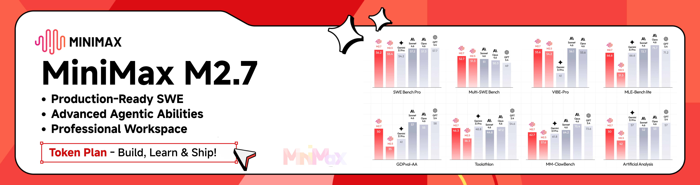](https://platform.minimax.io/subscribe/coding-plan?code=ClLhgxr2je&source=link)

MiniMax-M2.7 is a next-generation large language model designed for autonomous evolution and real-world productivity. Unlike traditional models, M2.7 actively participates in its own improvement through agent teams, dynamic tool use, and reinforcement learning loops. It delivers strong performance in software engineering (56.22% on SWE-Pro, 55.6% on VIBE-Pro, 57.0% on Terminal Bench 2) and excels in complex office workflows, achieving a leading 1495 ELO on GDPval-AA. With high-fidelity editing across Word, Excel, and PowerPoint, and a 97% adherence rate across 40+ complex skills, M2.7 sets a new standard for building AI-native workflows and organizations.

[Click](https://platform.minimax.io/subscribe/coding-plan?code=ClLhgxr2je&source=link) to get an exclusive 12% off the MiniMax Token Plan!

---

<table>
<tr>
<td width="180"><a href="https://www.packyapi.com/register?aff=cc-switch"></a></td>
<td>Thanks to PackyCode for sponsoring this project! PackyCode is a reliable and efficient API relay service provider, offering relay services for Claude Code, Codex, Gemini, and more. PackyCode provides special discounts for our software users: register using <a href="https://www.packyapi.com/register?aff=cc-switch">this link</a> and enter the "cc-switch" promo code during first recharge to get 10% off.</td>
</tr>

<tr>
<td width="180"><a href="https://aigocode.com/invite/CC-SWITCH"></a></td>
<td>Thanks to AIGoCode for sponsoring this project! AIGoCode is an all-in-one platform that integrates Claude Code, Codex, and the latest Gemini models, providing you with stable, efficient, and highly cost-effective AI coding services. The platform offers flexible subscription plans, zero risk of account suspension, direct access with no VPN required, and lightning-fast responses. AIGoCode has prepared a special benefit for CC Switch users: if you register via <a href="https://aigocode.com/invite/CC-SWITCH">this link</a>, you'll receive an extra 10% bonus credit on your first top-up!</td>
</tr>

<tr>
<td width="180"><a href="https://www.aicodemirror.com/register?invitecode=9915W3"></a></td>
<td>Thanks to AICodeMirror for sponsoring this project! AICodeMirror provides official high-stability relay services for Claude Code / Codex / Gemini CLI, with enterprise-grade concurrency, fast invoicing, and 24/7 dedicated technical support. Claude Code / Codex / Gemini official channels at 38% / 2% / 9% of original price, with extra discounts on top-ups! AICodeMirror offers special benefits for CC Switch users: register via <a href="https://www.aicodemirror.com/register?invitecode=9915W3">this link</a> to enjoy 20% off your first top-up, and enterprise customers can get up to 25% off!</td>
</tr>

<tr>
<td width="180"><a href="https://www.shengsuanyun.com/?from=CH_4HHXMRYF"></a></td>
<td>Thanks to Shengsuanyun for sponsoring this project! Shengsuanyun is a super factory serving AI Native Teams — an industrial-grade AI task parallel execution platform. Its model marketplace aggregates Claude, ChatGPT, Gemini, and other domestic and international LLM and multimedia model capabilities with direct supply. Absolutely no reverse engineering or dilution — platform-wide model SLA availability reaches 99.7%, with <a href="https://watch.shengsuanyun.com/status/shengsuanyun">monitoring dashboards</a> showing green across the board. It also offers enterprise-grade custom gateways for fine-grained team cost and permission management, smart routing, security protection, and BYOK (Bring Your Own Key) hosting. The platform charges on a pay-per-use and tokens plan (coming soon) basis, with invoicing available. Register via <a href="https://www.shengsuanyun.com/?from=CH_4HHXMRYF">this link</a> as a new user to receive ¥10 in credits plus a 10% bonus on your first top-up.</td>
</tr>

<tr>
<td width="180"><a href="https://pateway.ai/?ch=etzpm8&aff=WB6M6F67#/"></a></td>
<td>Thanks to PatewayAI for sponsoring this project! PatewayAI is an API relay service provider built for heavy AI developers, focused on directly relaying official high-quality model APIs. It offers the full Claude lineup and the Codex series, 100% sourced from official channels — no dilution, no fakes, verification welcome. Billing is transparent and every token-level invoice can be audited line by line. It also supports enterprise-grade concurrency and provides a dedicated management platform for enterprise customers — formal contracts and invoicing are available; visit the official website for contact details. Register now via <a href="https://pateway.ai/?ch=etzpm8&aff=WB6M6F67#/">this link</a> to receive $3 in trial credit. Top-ups go as low as 60% of the original price, with a two-way referral bonus of up to $150!</td>
</tr>

<tr>
<td width="180"><a href="https://www.byteplus.com/en/product/modelark?utm_campaign=hw&utm_content=ccswitch&utm_medium=devrel_tool_web&utm_source=OWO&utm_term=ccswitch">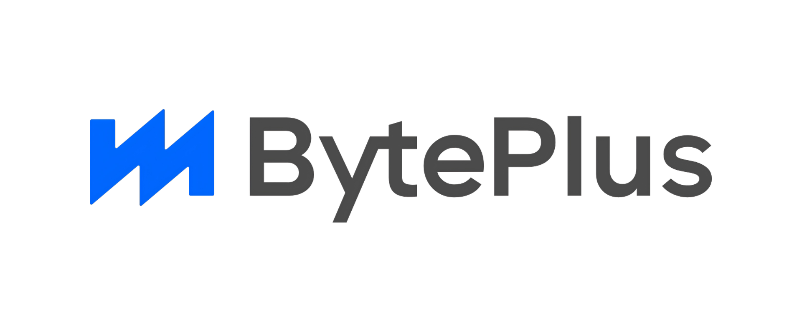</a></td>
<td>Thanks to Dola seed for sponsoring this project! Dola Seed 2.0 is a full-modal general large model independently developed by ByteDance for the global market. Built on a unified multimodal architecture, it supports joint understanding and generation of text, images, audio, and video. It natively enables agent collaboration, with strong reasoning, long-task execution, tool integration, and coding capabilities. It is widely applicable to smart cockpits, personal assistants, education, customer support, marketing, retail, and other scenarios. It excels in multimodal perception, end-to-end complex task delivery, stable interaction, and data security, and is readily accessible and deployable via the ModelArk platform. Register via <a href="https://www.byteplus.com/en/product/modelark?utm_campaign=hw&utm_content=ccswitch&utm_medium=devrel_tool_web&utm_source=OWO&utm_term=ccswitch">this link</a> to get 500,000 tokens of free inference quota per model.<a href="https://www.volcengine.com/activity/agentplan?utm_campaign=hw&utm_content=ccswitch&utm_medium=devrel_tool_web&utm_source=OWO&utm_term=ccswitch"> >>Developers in Mainland China please click here</a></td>
</tr>

<tr>
<td width="180"><a href="https://cloud.siliconflow.cn/i/drGuwc9k">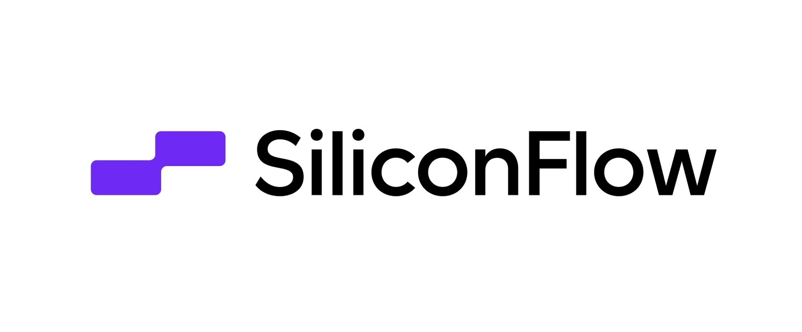</a></td>
<td>Thanks to SiliconFlow for sponsoring this project! SiliconFlow is a high-performance AI infrastructure and model API platform, providing fast and reliable access to language, speech, image, and video models in one place. With pay-as-you-go billing, broad multimodal model support, high-speed inference, and enterprise-grade stability, SiliconFlow helps developers and teams build and scale AI applications more efficiently. Register via <a href="https://cloud.siliconflow.cn/i/drGuwc9k">this link</a> and complete real-name verification to receive ¥16 in bonus credit, usable across models on the platform. SiliconFlow is also now compatible with OpenClaw, allowing users to connect a SiliconFlow API key and call major AI models for free.</td>
</tr>

<tr>
<td width="180"><a href="https://cubence.com/signup?code=CCSWITCH&source=ccs"></a></td>
<td>Thanks to Cubence for sponsoring this project! Cubence is a reliable and efficient API relay service provider, offering relay services for Claude Code, Codex, Gemini, and more with flexible billing options including pay-as-you-go and monthly plans. Cubence provides special discounts for CC Switch users: register using <a href="https://cubence.com/signup?code=CCSWITCH&source=ccs">this link</a> and enter the "CCSWITCH" promo code during recharge to get 10% off every top-up!</td>
</tr>

<tr>
<td width="180"><a href="https://www.dmxapi.cn/register?aff=bUHu">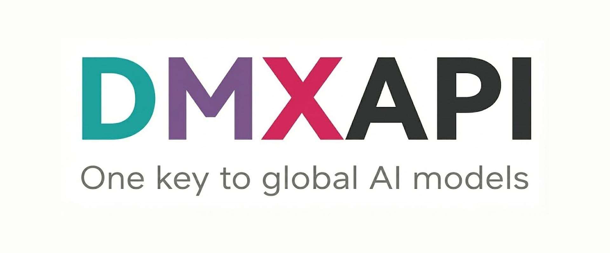</a></td>
<td>Thanks to DMXAPI for sponsoring this project! DMXAPI provides global large model API services to 200+ enterprise users. One API key for all global models. Features include: instant invoicing, unlimited concurrency, starting from $0.15, 24/7 technical support. GPT/Claude/Gemini all at 32% off, domestic models 20-50% off, Claude Code exclusive models at 66% off! <a href="https://www.dmxapi.cn/register?aff=bUHu">Register here</a></td>
</tr>

<tr>
<td width="180"><a href="https://www.compshare.cn/coding-plan?ytag=GPU_YY_YX_git_cc-switch"></a></td>
<td>Thanks to Compshare for sponsoring this project! Compshare is UCloud's AI cloud platform, providing stable and comprehensive domestic and international model APIs with just one key. Featuring cost-effective monthly and per-use domestic-model Coding Plan packages, alongside stable officially-relayed overseas models. Supports Claude Code, Codex, and API access. Enterprise-grade high concurrency, 24/7 technical support, and self-service invoicing. Users who register via <a href="https://www.compshare.cn/coding-plan?ytag=GPU_YY_YX_git_cc-switch">this link</a> will receive a free 5 CNY platform trial credit!</td>
</tr>

<tr>
<td width="180"><a href="https://crazyrouter.com/register?aff=OZcm&ref=cc-switch"></a></td>
<td>Thanks to Crazyrouter for sponsoring this project! Crazyrouter is a high-performance AI API aggregation platform — one API key for 300+ models including Claude Code, Codex, Gemini CLI, and more. All models at 55% of official pricing with auto-failover, smart routing, and unlimited concurrency. Crazyrouter offers an exclusive deal for CC Switch users: register via <a href="https://crazyrouter.com/register?aff=OZcm&ref=cc-switch">this link</a> and contact customer support to claim <strong>$2 free credit</strong>, plus enter promo code `CCSWITCH` on your first top-up for an extra <strong>30% bonus credit</strong>! </td>
</tr>

<tr>
<td width="180"><a href="https://www.right.codes/register?aff=CCSWITCH"></a></td>
<td>Thank you to Right Code for sponsoring this project! Right Code reliably provides routing services for models such as Claude Code, Codex, and Gemini, with both pay-as-you-go and monthly subscription billing options available. Invoices are available upon top-up, and enterprise and team users can receive dedicated one-on-one support. Right Code also offers an exclusive discount for CC Switch users: register via <a href="https://www.right.codes/register?aff=CCSWITCH">this link</a>, and with every top-up you will receive pay-as-you-go credit equivalent to 5% of the amount paid.</td>
</tr>

<tr>
<td width="180"><a href="https://www.sssaicode.com/register?ref=DCP0SM"></a></td>
<td>Thanks to SSSAiCode for sponsoring this project! SSSAiCode is a stable and reliable API relay service, dedicated to providing stable, reliable, and affordable Claude and Codex model services, with same-day fast invoicing. SSSAiCode offers a special deal for CC Switch users: register via <a href="https://www.sssaicode.com/register?ref=DCP0SM">this link</a> to enjoy $10 extra credit on every top-up!</td>
</tr>

<tr>
<td width="180"><a href="https://www.micuapi.ai/register?aff=aOYQ"></a></td>
<td>Thanks to Micu API for sponsoring this project! Micu API is a global LLM relay service provider dedicated to delivering the best cost-performance ratio with high stability. Backed by a registered enterprise for core assurance, eliminating any risk of service discontinuation, with fast official invoicing support! We champion "zero cost to try": top up from as low as ¥1 with no minimum, and get fee-free refunds anytime! Micu API offers an exclusive deal for CC Switch users: register via <a href="https://www.micuapi.ai/register?aff=aOYQ">this link</a> and enter promo code "ccswitch" when topping up to enjoy a <strong>10% discount</strong>!</td>
</tr>

<tr>
<td width="180"><a href="https://lemondata.cc/r/FFX1ZDUP"></a></td>
<td>Thanks to LemonData for sponsoring this project! LemonData is a high-performance AI API aggregation platform — one API key for 300+ models including GPT, Claude, Gemini, DeepSeek, and more. All models priced 30–70% below official rates with auto-failover, smart routing, and unlimited concurrency. New users get $1 free credit instantly upon registration — sign up via <a href="https://lemondata.cc/r/FFX1ZDUP">this link</a> to claim your bonus and start building right away!</td>
</tr>

<tr>
<td width="180"><a href="https://ctok.ai"></a></td>
<td>Thanks to CTok.ai for sponsoring this project! CTok.ai is dedicated to building a one-stop AI programming tool service platform. We offer professional Claude Code packages and technical community services, with support for Google Gemini and OpenAI Codex. Through carefully designed plans and a professional tech community, we provide developers with reliable service guarantees and continuous technical support, making AI-assisted programming a true productivity tool. Click <a href="https://ctok.ai">here</a> to register!</td>
</tr>

<tr>
<td width="180"><a href="https://console.claudeapi.com/register?aff=pCLD"></a></td>
<td>This project is sponsored by <a href="https://console.claudeapi.com/register?aff=pCLD">Claude API</a>. Direct Claude API access — connect Claude Code and Agent apps in 3 minutes. New users can claim a free trial credit. Powered by official Anthropic API keys + AWS Bedrock official channels. No reverse engineering, no model degradation. Full support for Opus / Sonnet / Haiku model lineup, with official capabilities preserved including Tool Use, 1M context window, and more. Built for Claude Code power users, Agent engineers, and enterprise engineering teams. Invoicing and dedicated team support available. Click <a href="https://console.claudeapi.com/register?aff=pCLD">here</a> to register!</td>
</tr>

<tr>
<td width="180"><a href="https://claudecn.top"></a></td>
<td>Thanks to ClaudeCN for sponsoring this project! ClaudeCN is an enterprise-grade AI gateway platform operated by a registered company. It delivers high-availability commercial API access to popular models including Claude, GPT, and DeepSeek, and is built around formal enterprise procurement workflows — corporate bank transfers, signed contracts, and full compliance. Register via <a href="https://claudecn.top">this link</a>!</td>
</tr>

<tr>
<td width="180"><a href="https://runapi.co"></a></td>
<td>Thanks to RunAPI for sponsoring this project! RunAPI is a high-performance and reliable AI model API gateway — one API key gives you access to 150+ mainstream models including OpenAI, Claude, Gemini, DeepSeek, and Grok, with prices as low as 10% of the official rate and excellent stability. It works seamlessly with Claude Code, OpenClaw, and other tools. Exclusive benefit for CC Switch users: register and contact customer support to claim a free ¥14 credit. Register via <a href="https://runapi.co">this link</a>!</td>
</tr>

<tr>
<td width="180"><a href="https://apikey.fun/register?aff=CCSwitch"></a></td>
<td>Thanks to APIKEY.FUN for sponsoring this project! APIKEY.FUN is a professional enterprise-grade AI relay platform dedicated to providing stable, efficient, and low-cost AI model API access for enterprises and individual developers. The platform supports popular mainstream models such as Claude, OpenAI, and Gemini, with prices as low as 7% of official rates. Register through this project's <a href="https://apikey.fun/register?aff=CCSwitch">exclusive link</a> to enjoy an exclusive offer of up to <strong>permanent 5% off top-ups</strong>.</td>
</tr>

<tr>
<td width="180"><a href="https://apinebula.com/02rw5X"></a></td>
<td>Thanks to APINEBULA for sponsoring this project! APINEBULA, an enterprise-grade AI aggregation platform under Galaxy Video Bureau, leverages extensive platform resources to provide developers, teams, and enterprises with stable, cost-effective access to large language model APIs. The platform integrates leading, full-powered models like Claude, GPT, and Gemini, allowing you to connect to the world's top AI models through a single API, with prices starting as low as 10% of the original cost. Designed for AI programming, Agent development, and business system integration, APINEBULA supports enterprise-grade high concurrency, formal contracts, corporate bank transfers, and invoicing services. APINEBULA provides special discounts for our software users: register using <a href="https://apinebula.com/02rw5X">this link</a> and enter the <strong>"ccswitch"</strong> promo code during your first recharge to get <strong>10% off</strong>.</td>
</tr>

<tr>
<td width="180"><a href="https://www.atlascloud.ai/coding-plan?utm_source=github&utm_campaign=cc-switch"></a></td>
<td>Atlas Cloud is a full-modal AI inference platform that gives developers a single AI API to access video generation, image generation, and LLM APIs. Instead of managing multiple vendor integrations, you connect once and get unified access to 300+ curated models across all modalities. Check out Atlas Cloud's new <a href="https://www.atlascloud.ai/coding-plan?utm_source=github&utm_campaign=cc-switch">coding plan</a> promotion for more budget-friendly API access!</td>
</tr>

</table>

</details>

---

## Why CC Switch?

Modern AI-powered coding relies on tools like Claude Code, Claude Desktop, Codex, Gemini CLI, OpenCode, OpenClaw, and Hermes — but each has its own configuration format. Switching API providers means manually editing JSON, TOML, or `.env` files, and there is no unified way to manage MCP and Skills across multiple tools.

**CC Switch** gives you a single desktop app to manage all supported AI tools. Instead of editing config files by hand, you get a visual interface to import providers with one click, switch between them instantly, with 50+ built-in provider presets, unified MCP and Skills management, and system tray quick switching — all backed by a reliable SQLite database with atomic writes that protect your configs from corruption.

- **One App, Seven Tools** — Manage Claude Code, Claude Desktop, Codex, Gemini CLI, OpenCode, OpenClaw, and Hermes from a single interface
- **No More Manual Editing** — 50+ provider presets including AWS Bedrock, NVIDIA NIM, and community relays; just pick and switch
- **Unified MCP & Skills Management** — One panel to manage MCP servers and Skills across Claude, Codex, Gemini, OpenCode, and Hermes with bidirectional sync
- **System Tray Quick Switch** — Switch providers instantly from the tray menu, no need to open the full app
- **Cloud Sync** — Sync provider data across devices via Dropbox, OneDrive, iCloud, or WebDAV servers
- **Cross-Platform** — Native desktop app for Windows, macOS, and Linux, built with Tauri 2
- **Built-in Utilities** — Includes various utilities for first-launch login confirmation, signature bypass, plugin extension sync, and more

---

## Screenshots

|                  Main Interface                   |                  Add Provider                  |
| :-----------------------------------------------: | :--------------------------------------------: |
| 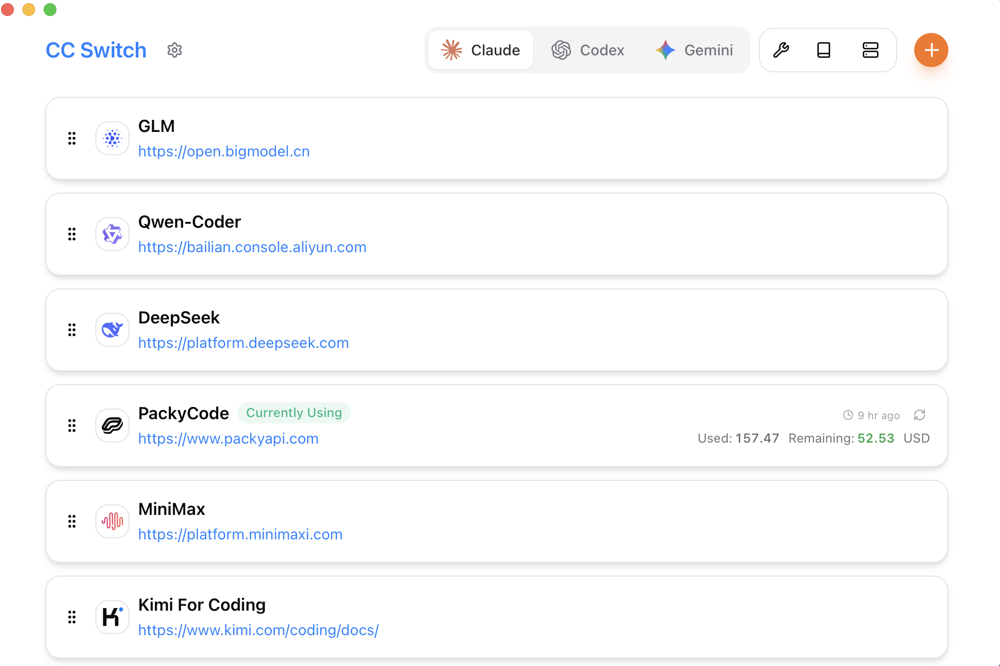 |  |

---

## Features

[Full Changelog](CHANGELOG.md) | [Release Notes](docs/release-notes/v3.16.1-en.md)

### Provider Management

- **7 supported tools, 50+ presets** — Claude Code, Claude Desktop, Codex, Gemini CLI, OpenCode, OpenClaw, Hermes; copy your key and import with one click
- **Universal providers** — One config syncs to Claude Code, Codex, and Gemini CLI
- One-click switching, system tray quick access, drag-and-drop sorting, import/export

### Proxy & Failover

- **Local proxy with hot-switching** — Format conversion, auto-failover, circuit breaker, provider health monitoring, and request rectifier
- **App-level takeover** — Independently proxy Claude, Codex, or Gemini, down to individual providers

### MCP, Prompts & Skills

- **Unified MCP panel** — Manage MCP servers across Claude, Codex, Gemini, OpenCode, and Hermes with bidirectional sync and Deep Link import
- **Prompts** — Markdown editor with cross-app sync (CLAUDE.md / AGENTS.md / GEMINI.md) and backfill protection
- **Skills** — One-click install from GitHub repos or ZIP files, custom repository management, with symlink and file copy support

### Usage & Cost Tracking

- **Usage dashboard** — Track spending, requests, and tokens with trend charts, detailed request logs, and custom per-model pricing

### Session Manager & Workspace

- Browse, search, and restore conversation history across supported session sources
- **Workspace editor** (OpenClaw) — Edit agent files (AGENTS.md, SOUL.md, etc.) with Markdown preview

### System & Platform

- **Cloud sync** — Custom config directory (Dropbox, OneDrive, iCloud, NAS) and WebDAV server sync
- **Deep Link** (`ccswitch://`) — Import providers, MCP servers, prompts, and skills via URL
- Dark / Light / System theme, auto-launch, auto-updater, atomic writes, auto-backups, i18n (zh/zh-TW/en/ja)

---

## FAQ

<details>
<summary><strong>Which AI tools does CC Switch support?</strong></summary>

CC Switch supports seven tools: **Claude Code**, **Claude Desktop**, **Codex**, **Gemini CLI**, **OpenCode**, **OpenClaw**, and **Hermes**. Each tool has dedicated provider presets and configuration management.

</details>

<details>
<summary><strong>Do I need to restart the terminal after switching providers?</strong></summary>

For most tools, yes — restart your terminal or the CLI tool for changes to take effect. The exception is **Claude Code**, which currently supports hot-switching of provider data without a restart.

</details>

<details>
<summary><strong>My plugin configuration disappeared after switching providers — what happened?</strong></summary>

CC Switch provides a "Shared Config Snippet" feature to pass common data (beyond API keys and endpoints) between providers. Go to "Edit Provider" → "Shared Config Panel" → click "Extract from Current Provider" to save all common data. When creating a new provider, check "Write Shared Config" (enabled by default) to include plugin data in the new provider. All your configuration items are preserved in the default provider imported when you first launched the app.

</details>

<details>
<summary><strong>macOS installation</strong></summary>

CC Switch for macOS is code-signed and notarized by Apple. You can download and install it directly — no extra steps needed. We recommend using the `.dmg` installer.

</details>

<details>
<summary><strong>Why can't I delete the currently active provider?</strong></summary>

CC Switch follows a "minimal intrusion" design principle — even if you uninstall the app, your CLI tools will continue to work normally. The system always keeps one active configuration, because deleting all configurations would make the corresponding CLI tool unusable. If you rarely use a specific CLI tool, you can hide it in Settings. To switch back to official login, see the next question.

</details>

<details>
<summary><strong>How do I switch back to official login?</strong></summary>

Add an official provider from the preset list. After switching to it, run the Log out / Log in flow, and then you can freely switch between the official provider and third-party providers. Codex supports switching between different official providers, making it easy to switch between multiple Plus or Team accounts.

</details>

<details>
<summary><strong>Where is my data stored?</strong></summary>

- **Database**: `~/.cc-switch/cc-switch.db` (SQLite — providers, MCP, prompts, skills)
- **Local settings**: `~/.cc-switch/settings.json` (device-level UI preferences)
- **Backups**: `~/.cc-switch/backups/` (auto-rotated, keeps 10 most recent)
- **Skills**: `~/.cc-switch/skills/` (symlinked to corresponding apps by default)
- **Skill Backups**: `~/.cc-switch/skill-backups/` (created automatically before uninstall, keeps 20 most recent)

</details>

---

## Documentation

For detailed guides on every feature, check out the **[User Manual](docs/user-manual/en/README.md)** — covering provider management, MCP/Prompts/Skills, proxy & failover, and more.

---

## Quick Start

### Basic Usage

1. **Add Provider**: Click "Add Provider" → Choose a preset or create custom configuration
2. **Switch Provider**:
   - Main UI: Select provider → Click "Enable"
   - System Tray: Click provider name directly (instant effect)
3. **Takes Effect**: Restart your terminal or the corresponding CLI tool to apply changes (Claude Code does not require a restart)
4. **Back to Official**: Add an "Official Login" preset, restart the CLI tool, then follow its login/OAuth flow

### MCP, Prompts, Skills & Sessions

- **MCP**: Click the "MCP" button → Add servers via templates or custom config → Toggle per-app sync
- **Prompts**: Click "Prompts" → Create presets with Markdown editor → Activate to sync to live files
- **Skills**: Click "Skills" → Browse GitHub repos → One-click install to supported apps
- **Sessions**: Click "Sessions" → Browse, search, and restore conversation history across supported session sources

> **Note**: On first launch, you can manually import existing CLI tool configs as the default provider.

---

## Download & Installation

### System Requirements

- **Windows**: Windows 10 and above
- **macOS**: macOS 12 (Monterey) and above
- **Linux**: Ubuntu 22.04+ / Debian 11+ / Fedora 34+ and other mainstream distributions

### Windows Users

Download the latest `CC-Switch-v{version}-Windows.msi` installer or `CC-Switch-v{version}-Windows-Portable.zip` portable version from the [Releases](../../releases) page.

### macOS Users

**Method 1: Install via Homebrew (Recommended)**

```bash
brew install --cask cc-switch
```

Update:

```bash
brew upgrade --cask cc-switch
```

**Method 2: Manual Download**

Download `CC-Switch-v{version}-macOS.dmg` (recommended) or `.zip` from the [Releases](../../releases) page.

> **Note**: CC Switch for macOS is code-signed and notarized by Apple. You can install and open it directly.

### Arch Linux Users

**Install via paru (Recommended)**

```bash
paru -S cc-switch-bin
```

### Linux Users

Download the latest Linux build from the [Releases](../../releases) page:

- `CC-Switch-v{version}-Linux.deb` (Debian/Ubuntu)
- `CC-Switch-v{version}-Linux.rpm` (Fedora/RHEL/openSUSE)
- `CC-Switch-v{version}-Linux.AppImage` (Universal)

> **Flatpak**: Not included in official releases. You can build it yourself from the `.deb` — see [`flatpak/README.md`](flatpak/README.md) for instructions.

---

<details>
<summary><strong>Architecture Overview</strong></summary>

### Design Principles

```
┌─────────────────────────────────────────────────────────────┐
│                    Frontend (React + TS)                    │
│  ┌─────────────┐  ┌──────────────┐  ┌──────────────────┐    │
│  │ Components  │  │    Hooks     │  │  TanStack Query  │    │
│  │   (UI)      │──│ (Bus. Logic) │──│   (Cache/Sync)   │    │
│  └─────────────┘  └──────────────┘  └──────────────────┘    │
└────────────────────────┬────────────────────────────────────┘
                         │ Tauri IPC
┌────────────────────────▼────────────────────────────────────┐
│                  Backend (Tauri + Rust)                     │
│  ┌─────────────┐  ┌──────────────┐  ┌──────────────────┐    │
│  │  Commands   │  │   Services   │  │  Models/Config   │    │
│  │ (API Layer) │──│ (Bus. Layer) │──│     (Data)       │    │
│  └─────────────┘  └──────────────┘  └──────────────────┘    │
└─────────────────────────────────────────────────────────────┘
```

**Core Design Patterns**

- **SSOT** (Single Source of Truth): All data stored in `~/.cc-switch/cc-switch.db` (SQLite)
- **Dual-layer Storage**: SQLite for syncable data, JSON for device-level settings
- **Dual-way Sync**: Write to live files on switch, backfill from live when editing active provider
- **Atomic Writes**: Temp file + rename pattern prevents config corruption
- **Concurrency Safe**: Mutex-protected database connection avoids race conditions
- **Layered Architecture**: Clear separation (Commands → Services → DAO → Database)

**Key Components**

- **ProviderService**: Provider CRUD, switching, backfill, sorting
- **McpService**: MCP server management, import/export, live file sync
- **ProxyService**: Local proxy mode with hot-switching and format conversion
- **SessionManager**: Conversation history browsing across supported session sources
- **ConfigService**: Config import/export, backup rotation
- **SpeedtestService**: API endpoint latency measurement

</details>

---

<details>
<summary><strong>Development Guide</strong></summary>

### Environment Requirements

- Node.js 18+
- pnpm 8+
- Rust 1.85+
- Tauri CLI 2.8+

### Development Commands

```bash
# Install dependencies
pnpm install

# Dev mode (hot reload)
pnpm dev

# Type check
pnpm typecheck

# Format code
pnpm format

# Check code format
pnpm format:check

# Run frontend unit tests
pnpm test:unit

# Run tests in watch mode (recommended for development)
pnpm test:unit:watch

# Build application
pnpm build

# Build debug version
pnpm tauri build --debug
```

### Rust Backend Development

```bash
cd src-tauri

# Format Rust code
cargo fmt

# Run clippy checks
cargo clippy

# Run backend tests
cargo test

# Run specific tests
cargo test test_name

# Run tests with test-hooks feature
cargo test --features test-hooks
```

### Testing Guide

**Frontend Testing**:

- Uses **vitest** as test framework
- Uses **MSW (Mock Service Worker)** to mock Tauri API calls
- Uses **@testing-library/react** for component testing

**Running Tests**:

```bash
# Run all tests
pnpm test:unit

# Watch mode (auto re-run)
pnpm test:unit:watch

# With coverage report
pnpm test:unit --coverage
```

### Tech Stack

**Frontend**: React 18 · TypeScript · Vite · TailwindCSS 3.4 · TanStack Query v5 · react-i18next · react-hook-form · zod · shadcn/ui · @dnd-kit

**Backend**: Tauri 2.8 · Rust · serde · tokio · thiserror · tauri-plugin-updater/process/dialog/store/log

**Testing**: vitest · MSW · @testing-library/react

</details>

---

<details>
<summary><strong>Project Structure</strong></summary>

```
├── src/                        # Frontend (React + TypeScript)
│   ├── components/
│   │   ├── providers/          # Provider management
│   │   ├── mcp/                # MCP panel
│   │   ├── prompts/            # Prompts management
│   │   ├── skills/             # Skills management
│   │   ├── sessions/           # Session Manager
│   │   ├── proxy/              # Proxy mode panel
│   │   ├── openclaw/           # OpenClaw config panels
│   │   ├── settings/           # Settings (Terminal/Backup/About)
│   │   ├── deeplink/           # Deep Link import
│   │   ├── env/                # Environment variable management
│   │   ├── universal/          # Cross-app configuration
│   │   ├── usage/              # Usage statistics
│   │   └── ui/                 # shadcn/ui component library
│   ├── hooks/                  # Custom hooks (business logic)
│   ├── lib/
│   │   ├── api/                # Tauri API wrapper (type-safe)
│   │   └── query/              # TanStack Query config
│   ├── locales/                # Translations (zh/zh-TW/en/ja)
│   ├── config/                 # Presets (providers/mcp)
│   └── types/                  # TypeScript definitions
├── src-tauri/                  # Backend (Rust)
│   └── src/
│       ├── commands/           # Tauri command layer (by domain)
│       ├── services/           # Business logic layer
│       ├── database/           # SQLite DAO layer
│       ├── proxy/              # Proxy module
│       ├── session_manager/    # Session management
│       ├── deeplink/           # Deep Link handling
│       └── mcp/                # MCP sync module
├── tests/                      # Frontend tests
└── assets/                     # Screenshots & partner resources
```

</details>

---

## Contributing

Issues and suggestions are welcome!

Before submitting PRs, please ensure:

- Pass type check: `pnpm typecheck`
- Pass format check: `pnpm format:check`
- Pass unit tests: `pnpm test:unit`

For new features, please open an issue for discussion before submitting a PR. PRs for features that are not a good fit for the project may be closed.

---

## Star History

[](https://www.star-history.com/#farion1231/cc-switch&Date)

---

## License

MIT © Jason Young
