# Mermaid �维导图模�

> 模�版本�.0.0
> 更新日期�026-03-23
> 图表类�：mindmap
> 引用�置：`templates.md` §�

---

## 一�标准注入头

```mermaid
%%{init: {
  'theme': 'base',
  'themeVariables': {
    'primaryColor': '[book.color]',
    'primaryTextColor': '#ffffff',
    'primaryBorderColor': '[book.color]',
    'lineColor': '[book.color]88',
    'secondaryColor': '[book.lightBg]',
    'tertiaryColor': '[book.accentBg]',
    'fontFamily': 'Source Han Sans SC, Microsoft YaHei, SimHei, sans-serif'
  }
}}%%
```

---

## 二�基础模�

### 2.1 �层级�维导图

```mermaid
%%{init: { 'theme': 'base', 'themeVariables': { 'primaryColor': '[book.color]', 'primaryTextColor': '#ffffff', 'primaryBorderColor': '[book.color]', 'lineColor': '[book.color]88', 'fontFamily': 'Source Han Sans SC, Microsoft YaHei, SimHei, sans-serif' } }}%%
mindmap
  root((主题))
    分支一
      �节点A
      �节点B
    分支�
      �节点C
      �节点D
```

### 2.2 多层级导�

```mermaid
%%{init: { 'theme': 'base', 'themeVariables': { 'primaryColor': '[book.color]', 'primaryTextColor': '#ffffff', 'primaryBorderColor': '[book.color]', 'lineColor': '[book.color]88', 'fontFamily': 'Source Han Sans SC, Microsoft YaHei, SimHei, sans-serif' } }}%%
mindmap
  root((核心概念))
    维度一
      �点1.1
        细节A
        细节B
      �点1.2
    维度�
      �点2.1
      �点2.2
    维度�
      �点3.1
        细节C
```

---

## 三�使用指�

### 3.1 节点标签约�

| 约� | 规则 |
|------|------|
| **最大字�* | �节点标��5 个汉�|
| 层级结� | 根节��分支 ��节点，�级展开 |
| 简��| �个节点一个核心概�|

### 3.2 布局说�

- `root((标题))` - 中心主题，用�括�
- `分支` - 一级分支，普通文�
- `  �节点` - 二级分支，缩�
- `    细节` - 三级分支，缩进更�

### 3.3 图注约定

```markdown

```mermaid
mindmap
  root((知识体系))
    模�A
      概念1
      概念2
    模�B
      概念3
```

<!-- FIG: 6-1：知识结�导�-->
```

### 3.4 选择�则

| 适用 | �适用 |
|------|--------|
| 概念�散/分类 | 步骤�程（用flowchart�|
| 知识结�梳� | 时间�列（用timeline�|
| 头脑�暴整� | 项目�期（用gantt�|

---

## 四�模�速查

```mermaid
%%{init: { 'theme': 'base', 'themeVariables': { 'primaryColor': '[book.color]', 'primaryTextColor': '#ffffff', 'primaryBorderColor': '[book.color]', 'lineColor': '[book.color]88', 'fontFamily': 'Source Han Sans SC, Microsoft YaHei, SimHei, sans-serif' } }}%%
mindmap
  root((主题))
    分类A
      �点1
      �点2
    分类B
      �点3
      �点4
```
