# Mermaid 状�图模�

> 模�版本�.0.0
> 更新日期�026-03-23
> 图表类型：stateDiagram-v2
> 引用�置：`templates.md` §�

---

## 一�标准注入头

```mermaid
%%{init: {
  'theme': 'base',
  'themeVariables': {
    'primaryColor': '[book.color]',
    'primaryTextColor': '#ffffff',
    'primaryBorderColor': '[book.color]',
    'lineColor': '[book.color]88',
    'secondaryColor': '[book.lightBg]',
    'tertiaryColor': '[book.accentBg]',
    'fontFamily': 'Source Han Sans SC, Microsoft YaHei, SimHei, sans-serif'
  }
}}%%
```

---

## 二�基础模�

### 2.1 简�状�转�

```mermaid
%%{init: { 'theme': 'base', 'themeVariables': { 'primaryColor': '[book.color]', 'primaryTextColor': '#ffffff', 'primaryBorderColor': '[book.color]', 'lineColor': '[book.color]88', 'fontFamily': 'Source Han Sans SC, Microsoft YaHei, SimHei, sans-serif' } }}%%
stateDiagram-v2
  [*] --> �始状�
  �始状�--> 进行� 事件A
  进行�--> 完�: 事件B
  完� --> [*]
```

### 2.2 多状�分�

```mermaid
%%{init: { 'theme': 'base', 'themeVariables': { 'primaryColor': '[book.color]', 'primaryTextColor': '#ffffff', 'primaryBorderColor': '[book.color]', 'lineColor': '[book.color]88', 'fontFamily': 'Source Han Sans SC, Microsoft YaHei, SimHei, sans-serif' } }}%%
stateDiagram-v2
  [*] --> 待处�

  state 待处�{
    [*] --> 审核�
    审核�--> 审核通过: 批准
    审核�--> 审核拒�: 拒�
  }

  审核通过 --> 已�� 上线
  审核拒� --> 待处� �新�交
  已��--> [*]
```

### 2.3 状�与动作

```mermaid
%%{init: { 'theme': 'base', 'themeVariables': { 'primaryColor': '[book.color]', 'primaryTextColor': '#ffffff', 'primaryBorderColor': '[book.color]', 'lineColor': '[book.color]88', 'fontFamily': 'Source Han Sans SC, Microsoft YaHei, SimHei, sans-serif' } }}%%
stateDiagram-v2
  [*] --> 空闲

  state 空闲 {
    [*] --> idle_entry: 进入
    idle_entry --> idle: 完�
    idle --> idle_exit: 退�
    idle_exit --> [*]: 离开
  }

  空闲 --> 活动� 激�
  活动�--> 空闲: 结�
```

---

## 三�使用指�

### 3.1 状�命�约�

| 约� | 规则 |
|------|------|
| **最大字�* | 状�� �5 个汉�|
| 动宾结构 | 使用"动�+��"：`审核中`�`已完�` |
| 简��| ��过长�述 |

### 3.2 转�标注

```mermaid
%%{init: { 'theme': 'base', 'themeVariables': { 'primaryColor': '[book.color]', 'lineColor': '[book.color]88' } }}%%
stateDiagram-v2
  [*] --> A
  A --> B: 事件/�件
```

### 3.3 图注约定

```markdown

```mermaid
stateDiagram-v2
  [*] --> 待处�
  待处�--> 已完� 完�
  已完�--> [*]
```

<!-- FIG: 5-1：任务状���-->
```

### 3.4 选择原则

| 适用 | �适用 |
|------|--------|
| 状���生命周期 | 步骤�程（用flowchart�|
| 阶段转�场景 | 并行活动（用flowchart�|
| 对象状�管�| 角色交互（用sequenceDiagram�|

---

## 四�模�速查

```mermaid
%%{init: { 'theme': 'base', 'themeVariables': { 'primaryColor': '[book.color]', 'primaryTextColor': '#ffffff', 'primaryBorderColor': '[book.color]', 'lineColor': '[book.color]88', 'fontFamily': 'Source Han Sans SC, Microsoft YaHei, SimHei, sans-serif' } }}%%
stateDiagram-v2
  [*] --> 状�A
  状�A --> 状�B: 事件
  状�B --> 状�C: 事件
  状�C --> [*]
```
