# Mermaid 时间线模�

> 模�版本�.0.0
> 更新日期�026-03-23
> 图表类�：timeline
> 引用�置：`templates.md` §�

---

## 一�标准注入头

```mermaid
%%{init: {
  'theme': 'base',
  'themeVariables': {
    'primaryColor': '[book.color]',
    'primaryTextColor': '#ffffff',
    'primaryBorderColor': '[book.color]',
    'lineColor': '[book.color]88',
    'secondaryColor': '[book.lightBg]',
    'tertiaryColor': '[book.accentBg]',
    'fontFamily': 'Source Han Sans SC, Microsoft YaHei, SimHei, sans-serif'
  }
}}%%
```

---

## 二�基础模�

### 2.1 简�时间线

```mermaid
%%{init: { 'theme': 'base', 'themeVariables': { 'primaryColor': '[book.color]', 'primaryTextColor': '#ffffff', 'primaryBorderColor': '[book.color]', 'lineColor': '[book.color]88', 'fontFamily': 'Source Han Sans SC, Microsoft YaHei, SimHei, sans-serif' } }}%%
timeline
  title 时间标题
    阶段一: 任务A
    阶段� 任务B
    阶段� 任务C
```

### 2.2 详细时间�

```mermaid
%%{init: { 'theme': 'base', 'themeVariables': { 'primaryColor': '[book.color]', 'primaryTextColor': '#ffffff', 'primaryBorderColor': '[book.color]', 'lineColor': '[book.color]88', 'fontFamily': 'Source Han Sans SC, Microsoft YaHei, SimHei, sans-serif' } }}%%
timeline
  title 项目阶段

    阶段一：规�
      需求调�
      方案设计
      评审通过

    阶段二：执行
      开���
      迭代开�
      测试验�

    阶段三：收尾
      上线部署
      用户培训
      项目验收
```

---

## 三�使用指�

### 3.1 标签约�

| 约� | 规则 |
|------|------|
| **最大字�* | �标��5 个汉�|
| 阶段划分 | 按时间或里程碑切�|
| 任务�述 | 简�的动宾结� |

### 3.2 时间格�

```
阶段�：任务�述
  �任�
  �任�
```

### 3.3 图注约定

```markdown

```mermaid
timeline
  title 项目周期
    准备阶段: 调研
    开�阶� 编�
    上线阶段: 部署
```

<!-- FIG: 7-1：项目�施时间线 -->
```

### 3.4 选择�则

| 适用 | �适用 |
|------|--------|
| 阶段时间�| �时数�（用table�|
| 项目�施过程 | ��结�（用stateDiagram�|
| ���展脉络 | 任务�期（用gantt�|

---

## 四�模�速查

```mermaid
%%{init: { 'theme': 'base', 'themeVariables': { 'primaryColor': '[book.color]', 'primaryTextColor': '#ffffff', 'primaryBorderColor': '[book.color]', 'lineColor': '[book.color]88', 'fontFamily': 'Source Han Sans SC, Microsoft YaHei, SimHei, sans-serif' } }}%%
timeline
  title 阶段概览
    阶段一: 任务A
    阶段� 任务B
    阶段� 任务C
```
